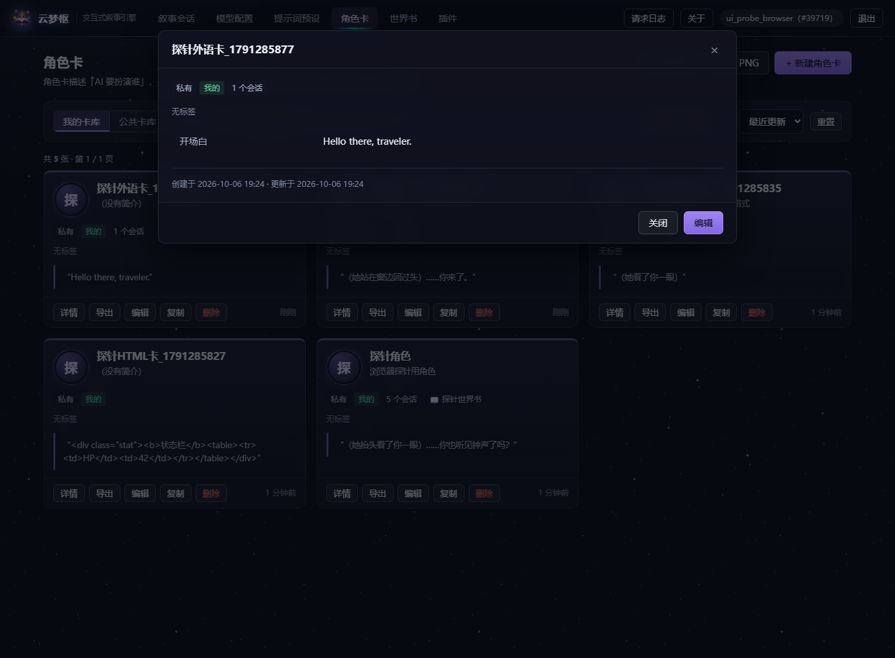
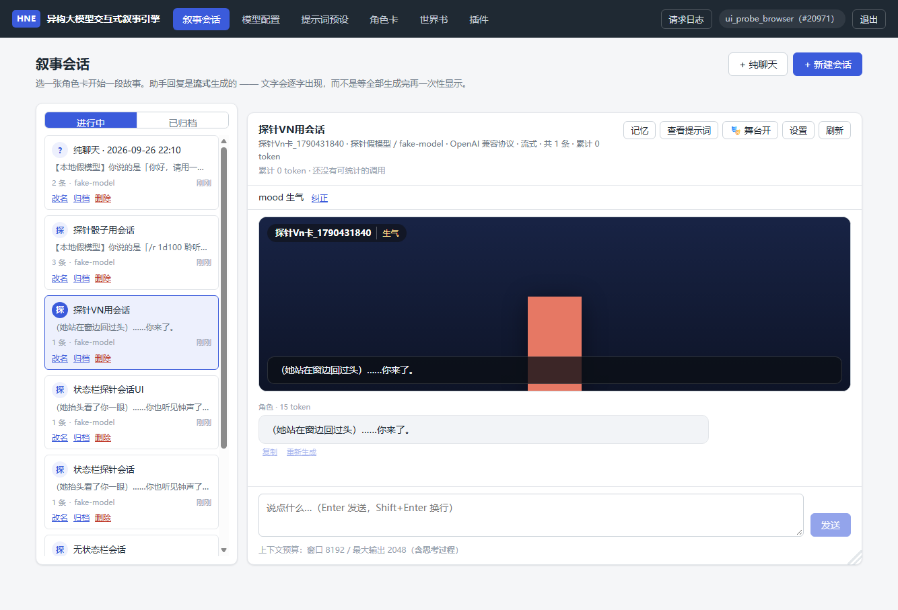
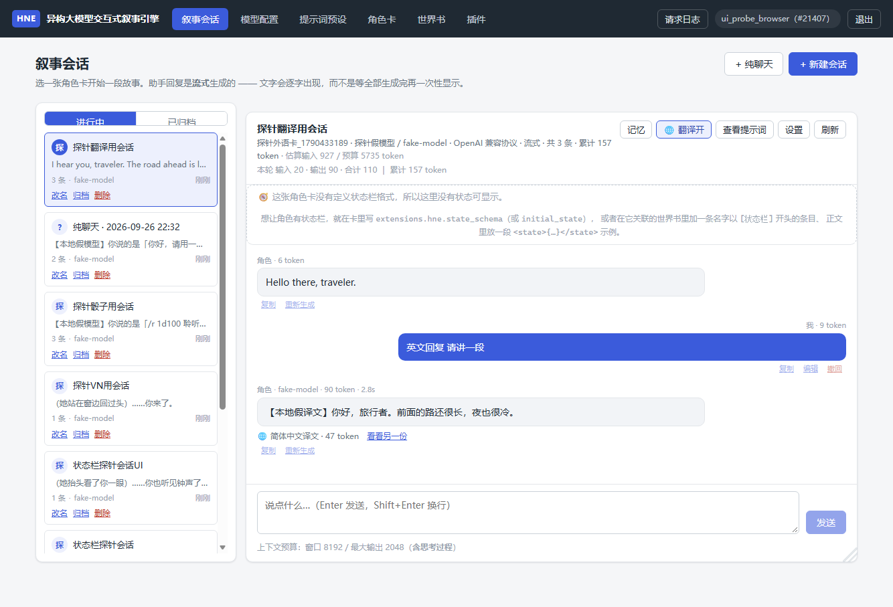

# 异构大模型交互式叙事引擎

> 支持用户自配任意大模型 API（自定义 URL / Key / 模型名）的交互式叙事引擎 —— 后端服务

## 技术栈

| 层次 | 选型 |
|---|---|
| 语言 | Python 3.13 |
| Web 框架 | FastAPI + Uvicorn |
| 关系数据库 | **默认 SQLite**（一个文件，装完即用）／ **可选 MySQL 8.0**（SQLAlchemy 2.0 一套代码两种后端） |
| 向量数据库 | ChromaDB 1.5（PersistentClient 持久化） |
| LLM 接入 | httpx 自研统一适配层，兼容 OpenAI / Anthropic / Ollama 等异构协议 |
| 认证 | PyJWT + bcrypt |

前端（后续）：HTML / CSS / JavaScript，最终通过 Electron 打包为桌面应用。

> **当前状态**：后端 3.1~3.10 完成，可视化控制台可直接使用（含叙事对话界面与消息级操作）。
> **913 项 `pytest` 全绿**（SQLite 后端；另有 3 项按环境跳过 —— 真实预设 2 项 + 连接池参数 1 项。
> 换到 MySQL 后端则是 **914 passed / 2 skipped**：那一项连接池断言只在 MySQL 下有意义。
> 两种后端跑的是同一套用例）、
> **184 项端到端冒烟全过**、**147 项真实浏览器探针全过**（控制台报错 0 条）。
> 桌面版已完成三个阶段：Electron 壳 → PyInstaller 打包后端 → **Windows 安装包**
> （`desktop/` 自带 **160 项 Node 自测**，多出一条命令即可装出来用，见 `desktop/README.md` §8）。
> **装完即用**：默认数据存成本机的一个 SQLite 文件，不需要安装任何数据库服务，
> 也不需要事先建库建表 —— 表由后端启动时自动创建，密钥由后端首次运行自动生成。
> 仍然需要你自备的只有一样：**你自己要用的那个大模型 API Key**。

前端（后续）：HTML / CSS / JavaScript，已通过 Electron 打包为桌面应用。

## 数据存哪里：SQLite（默认）与 MySQL（可选）

云梦枢是**单机桌面应用**，所以默认用 SQLite —— 数据是**一个文件**，
不需要为了用它先去装一个数据库服务器。两种后端跑的是**同一套代码**：

| | `HNE_DB_BACKEND=sqlite`（默认） | `HNE_DB_BACKEND=mysql` |
|---|---|---|
| 需要额外安装 | **什么都不用** | MySQL 8 服务 + 建库建账号 |
| 数据位置 | `<数据目录>/data/app.sqlite3` 一个文件 | MySQL 实例里的一个库 |
| 建表 | 后端启动时自动（幂等） | 后端启动时自动（幂等），也可用 `scripts/init_db.py` |
| 适合 | **单机单用户**（本项目的形态） | 多人共用同一个库、或你已经有 MySQL |
| 已知限制 | **单写者**：同一时刻只允许一个写事务 | 需要维护一个数据库服务 |

后端启动时会自己把该做的做完（`app/db/bootstrap.py`）：

1. **建表**：`create_all`，已存在的表原样不动（幂等）。此前只有 `scripts/init_db.py` 会建表，
   于是"连得上空库、一注册就报 table doesn't exist"—— 桌面应用不允许让用户先跑脚本。
2. **生成密钥**：`SECRET_KEY` 与 `API_KEY_ENCRYPTION_KEY` 若为空/占位符/格式非法，
   就自动生成并写到 `<数据目录>/config/.secrets.env`（0600）。**只补缺失的，绝不覆盖已有的** ——
   因为换掉 `API_KEY_ENCRYPTION_KEY` 会让用户已保存的 LLM API Key 永远解不开。

想切到 MySQL：在 `.env`（或桌面版的 `config\.env`）里写

```ini
HNE_DB_BACKEND=mysql
HNE_MYSQL_HOST=127.0.0.1
HNE_MYSQL_PORT=3306
HNE_MYSQL_USER=narrative_app
HNE_MYSQL_PASSWORD=你的密码
HNE_MYSQL_DB=narrative_engine
```

**两处为了兼容两种后端而必须不同的地方**都集中在 `app/db/dialect.py`，并且各有测试盯着：

- `LIKE ... ESCAPE '!'`：SQLAlchemy 默认生成的 `LIKE` **没有 ESCAPE 子句**，
  而 SQLite **没有默认转义符** —— 于是用户搜 "50%" 会命中 0 条。显式写出 ESCAPE 后两边语义一致。
- `JSON_CONTAINS` vs `instr`：MySQL 有 `JSON_CONTAINS`，SQLite 没有（标签筛选在那里退化为
  文本子串匹配，靠 JSON 里元素两侧的引号保证"精确匹配而不是前缀命中"）。

> 开发/测试侧同样零门槛：默认后端就是 sqlite，`pytest` 不需要任何外部服务。
> 想验证 MySQL 那条路：`$env:HNE_DB_BACKEND='mysql'; .\.venv\Scripts\python.exe -m pytest -q`。

## 快速开始

```powershell
# 1. 创建并激活虚拟环境
python -m venv .venv
.\\.venv\\Scripts\\Activate.ps1

# 2. 安装依赖
python -m pip install -r requirements.txt

# 3. 配置环境变量（★ 这一步现在可以跳过）
#    默认后端是 sqlite，表与密钥都由后端自己搞定，所以**什么都不配也能跑**。
#    想自己掌控（或用 MySQL）时再复制模板：
Copy-Item .env.example .env
# ★ 所有环境变量都必须带 HNE_ 前缀，原因见下方「配置命名空间」一节

# 4. 启动开发服务器（首次启动会在 ./data/ 下建库、建表并生成密钥）
python -m uvicorn app.main:app --reload --host 127.0.0.1 --port 8000
```

启动后访问：

- **可视化控制台：http://127.0.0.1:8000/console** ← 图形界面，直接点着用
- 接口文档（Swagger）：http://127.0.0.1:8000/docs
- 接口文档（ReDoc）：http://127.0.0.1:8000/redoc
- 健康检查：http://127.0.0.1:8000/health

## 可视化控制台（可点击原型）

`web/` 目录下是一个**零依赖、零构建步骤**的前端原型：纯 HTML + CSS + ES Module，
没有 npm、没有打包工具，由 FastAPI 直接托管在 `/console`。

```powershell
# 启动后浏览器打开 http://127.0.0.1:8000/console
.\.venv\Scripts\python.exe -m uvicorn app.main:app --reload --host 127.0.0.1 --port 8000
```

### 为什么不用框架 / 不装 npm

| 考虑 | 说明 |
|---|---|
| 降低上手成本 | 不用装 Node、不用 `npm install`、不用等打包，改完刷新页面即可 |
| 便于答辩演示 | 现场只要一个 Python 环境就能跑起来 |
| 为 Electron 铺路 | 这套代码将来可以**原样**套进 Electron，不需要重写 |
| 够用 | 需要的是「能点、能验证功能」，不是复杂的状态管理 |

### ★ 前端缓存击穿：改了代码为什么不会白屏

原生 ES Module 是**按 URL 缓存**的。如果模块之间用相对路径互导
（`import ... from '../ui.js'`），改动其中一部分文件时，用户浏览器里就会
出现「新的 `views/chat.js` + 旧的 `ui.js`」这种**版本混用**；
而 import 一个目标模块里不存在的导出是**语法级错误，整个模块图加载失败** ——
页面一片空白，用户按 `Ctrl+F5` 也未必救得回来（真实踩过，见 `docs/pitfalls.md` 第 21 条）。

所以这里做了两层：

| 机制 | 位置 | 作用 |
|---|---|---|
| **importmap + 版本号** | `web/index.html`（后端渲染时注入 `__WEB_VERSION__`） | 模块之间只写裸名（`import { modal } from 'hne/ui'`），真实 URL 带版本号；版本一变 URL 全变，浏览器没有旧副本可用 |
| **启动守卫** | `web/js/boot.js` | `index.html` 自己被缓存住时，向服务器核对版本并自动重载；彻底救不回来才显示一条红色提示，而不是让用户看着白屏 |

版本号 = 所有前端文件 `mtime + size` 的指纹（`app/main.py::_frontend_version`），
**只在文件真的改过时才变** —— 所以只改后端时前端照旧吃缓存，不牺牲性能。
`tests/test_console.py` 有 6 项回归测试把这套机制钉死（含"模块之间禁止相对导入"）。

### 它能点哪些功能

界面上覆盖了**目前后端已经实现**的全部能力：

| 界面 | 能做什么 |
|---|---|
| 登录 / 注册 | 注册后自动登录；登录态存 localStorage；令牌失效自动退回登录页 |
| **叙事会话** | **对话界面 + 打字机流式**：新建会话、会话列表（进行中 / 已归档）、重命名 / 归档 / 删除、发消息（Enter 发送）、**停止生成**、**消息级操作（复制 / 编辑 / 撤回 / 重新生成）**、查看提示词（**按预设块展示来源**）、会话设置（换卡 / 换模型 / **换提示词预设**）、**记忆面板**（语义检索 / 手动记一条 / 清空）、**拖动右下角手柄调节对话区大小并记住尺寸**、**★ 状态栏（字段由角色卡 / 世界书定义，可手动纠正；★ 收成一行放在最新回复的下方，点「详情」展开，并可查看模型输出的 `<state>` 作者原格式）**；头部实时显示「世界书命中 N 条 · 回忆 N 条 · 估算输入 / 预算」与 **Token 统计（本轮输入/输出/思考 + 累计）** |
| 模型配置 | 增删改查、连通性测试（**失败时弹窗给出实际请求地址 / 上游状态 / 上游原话 + 排查顺序**）、拉取模型列表、思考强度探测；**常见厂商 Base URL 一键预设**；**生成参数表单带实时上下文预算预览** |
| **提示词预设** | ★ **酒馆式 completion preset**：导入/导出 SillyTavern 预设、新建（以内置装配为模板）、块清单（**启停 / 排序 / 角色 / 注入方式 / 注入深度**）、加自定义规则块、装配预览（**逐条消息标出来源块与"插在倒数第几条之前"**）；如实标注不支持的块、不认识的宏、**云端会忽略的参数**。会话级绑定 + 全局默认 |
| 我的角色卡 | 增删改查、**PNG 拖拽导入**、JSON 粘贴导入、导出下载 `.json`、复制；公开/私有切换；卡片带品牌色顶边与清晰信息层级（谁 / 干嘛的 / 开场白），整卡可点范围更大 |
| 公共卡库 | 浏览他人公开的卡；只能查看与「复制到我名下」（改会 403） |
| 世界书 | 增删改查、**条目编辑器**（关键词 / 设定正文 / 启用 / 插入顺序）、**扫描参数**（`scan_depth` / `token_budget`）、删除保护 |

界面默认落在**叙事会话**页（顶栏也把它排在第一位）。

### ★ 六个刻意做的交互

**1. 删除角色卡时的勾选弹窗。** 前端先发一次不带 `force` 的 `DELETE`，
后端若返回 `409`，弹窗就读 `detail` 渲染出复选框（**默认都勾选**），
并在世界书被别的卡共用时说明「即使勾选也会为它们保留」。

**2. 请求日志面板。** 右上角「请求日志」按钮打开一个抽屉，
列出每一次 API 调用的方法、路径、状态码、耗时，
点开还能看到**原始请求体与原始响应体**。
这样界面上任何一个操作，你都能立刻看到它到底发了什么、后端回了什么 ——
排查问题时不用开浏览器开发者工具。

**3. 对话头部把「这一轮到底用了什么」全部摊开。**
世界书命中几条、回忆召回几条、估算输入占多少预算、上下文有没有被裁剪、
这一轮输入/输出/思考各花了多少 token ——
没有这些数字，"关键词触发"和"长期记忆"是否真的在工作是完全看不出来的。

**4. Base URL 填错时，界面要能自己把问题说清楚。**
接不通第三方模型最常见的原因**不是 Key 错，而是把完整的接口地址粘进了 Base URL**
（例如把火山方舟的 `…/api/v3/responses` 当成 OpenAI 兼容地址）。
本项目的请求地址 = `base_url + /chat/completions`，多出来的一段会让请求打到
`…/responses/chat/completions`，对方返回「模型不存在」——**把地址问题伪装成模型名问题**。
所以：表单里有常见厂商的地址预设；粘贴完整地址时前端会自动削掉多余段并提示；
后端也会拒绝这种配置并告诉你该填成什么。测试失败时弹窗会列出
**实际请求地址 / 上游 HTTP 状态 / 上游原话**，再按错误类型给出排查顺序。

> 界面上不会出现任何「点了没反应」的假按钮：所有按钮都对后端已实现的接口。
> 唯一的例外是 `recursive_scanning`（递归扫描）**尚未实现**，
> 所以界面上**没有**给它做开关，而不是做一个点了没用的开关。

**5. 对话区大小自己拖。** 右下角有一个小三角手柄：
**左右拖**改左侧会话列表宽度，**上下拖**改整个对话区高度，双击恢复默认。
尺寸记在 `localStorage` 里，下次进来还是你调好的样子。
（纯 CSS 的 `resize` 做不到"同时改宽和高"，所以这里用 pointer 事件自己实现；
窄屏下布局本来就变成上下堆叠，手柄会自动隐藏。）

> 截图：`docs/console-screenshot.png`（对话页）、`docs/cards-screenshot.png`（角色卡页）
> 与 `docs/presets-screenshot.png`（提示词预设页），
> 由 `scripts/ui_probe.py` 每次跑完自动生成，所以它们**不会过期**。

**6. 预设里的"看不见就等于不知道有没有生效"，所以全部摊开。**
「查看提示词」会列出这次**生效了哪些块、哪些被你禁用了、哪些被跳过、哪些宏不认识**，
旁边一个按钮展开**完整装配预览**：逐条消息标出来源块，
以及深度注入的块**插在倒数第几条之前**。
破甲这类东西如果看不见，用户只能靠"感觉模型听话了没有"来判断 —— 那是不可接受的。

## 配置命名空间（重要）

**所有配置项都必须带 `HNE_` 前缀**（HNE = Hetero Narrative Engine）。

```ini
HNE_MYSQL_PASSWORD=***
HNE_DEFAULT_LLM_BASE_URL=https://api.deepseek.com
HNE_EMBEDDING_BACKEND=onnx_default
```

为什么？这是开发过程中踩过的真实坑：

> 最初配置项叫 `DEFAULT_LLM_BASE_URL`、`HOST`、`PORT`、`DEBUG` 这类通用名。
> 结果运行环境里恰好存在**同名**的环境变量（值为空字符串），
> 而环境变量的优先级**高于** `.env`，于是 `.env` 里认真填好的地址被空值
> **静默覆盖** —— 不报错，只是配置莫名其妙不生效。

`HOST` / `PORT` / `DEBUG` / `APP_NAME` 这类通用名在真实部署中到处都可能撞车：
CI 系统、Docker、IDE、其他 CLI 工具、云平台注入的变量……

加前缀之后，只有 `HNE_XXX` 形式的变量会被读取，其余一律忽略，
意外撞车的概率基本归零。部署时若要用环境变量覆盖配置，
也请使用带前缀的名字，例如 `HNE_PORT=9000`。

## 目录结构

```
app/
├─ main.py             FastAPI 应用入口（工厂模式 + lifespan 生命周期）
├─ core/               基础设施：配置、日志、安全、异常、请求上下文
├─ db/                 数据访问层：MySQL 连接池、ChromaDB 客户端、ORM 模型
├─ schemas/            Pydantic 请求/响应模型
├─ api/v1/             路由层（只做参数校验与编排）
├─ services/           业务逻辑层
├─ llm/                ★ 异构大模型适配层（论文核心）
├─ narrative/          叙事引擎核心：提示词构建、上下文管理、记忆管理、
│                      ★ 提示词预设（presets.py：酒馆式块装配 + 深度注入）
└─ utils/              通用工具

web/                   可视化控制台（零依赖前端原型）
├─ index.html          入口页（含 importmap：模块 URL 由后端注入版本号）
├─ css/styles.css
└─ js/
   ├─ boot.js          启动守卫：核对前端版本，缓存不一致时自动重载（防白屏）
   ├─ api.js           统一 API 客户端（含 token 与请求日志广播）
   ├─ ui.js            DOM 助手 / 弹窗 / 表单片段 / 加载态
   ├─ app.js           路由 + AbortController（监听器生命周期）+ 请求日志面板
   └─ views/           各功能视图：auth / providers / presets / cards / books / chat

scripts/               运维与验证脚本
├─ init_db.py          建表 / 导出 SQL
├─ migrate_db.py       ★ 幂等补齐新增的列（--dry-run 可预演，不删数据）
├─ cleanup_demo_data.py 清理测试遗留数据
├─ smoke_test.py       ★ 端到端冒烟（真实 HTTP + 直连数据库双通道核对）
└─ fake_openai_server.py 本机假模型（逐字吐字，不联网不花钱）

tests/                 pytest 测试（586 项）
```

**分层原则**：`api`（收请求）→ `services`（业务）→ `db` / `llm`（外部依赖）。
`llm` 层与业务层完全解耦，更换任意模型厂商都不需要修改业务代码。

## 统一响应格式

成功：

```json
{ "code": "OK", "message": "success", "data": { } }
```

失败：

```json
{ "code": "NOT_FOUND", "message": "请求的资源不存在", "detail": null, "request_id": "3f9a1c2b8d4e5f60" }
```

每次响应都会带上 `X-Request-ID` 响应头，与日志中的 request_id 对应，便于排查问题。

## 数据库表结构

| 表名 | 说明 | 关键设计 |
|---|---|---|
| `users` | 用户 | 密码只存 bcrypt 哈希；`username`/`email` 唯一索引 |
| `llm_providers` | 用户自配的大模型 API | `api_key_encrypted` 存 Fernet 密文；`extra_params` 为 JSON |
| `character_cards` | 角色卡 | 人设字段齐全 + `greeting` 开场白；`extra_data` 保存导入卡片的未映射字段 |
| `world_books` | 世界书（世界观设定集） | ★ 独立成表，**可被多张角色卡共用**；`entries` 为条目数组 |
| `narrative_sessions` | 叙事会话（存档） | `rolling_summary` 存剧情滚动摘要，用于压缩上下文 |
| `messages` | 对话消息 | 复合索引 `(session_id, id)` 贴合「按会话取历史」查询 |

### 外键级联策略

| 删除什么 | 关联数据怎么办 | 为什么 |
|---|---|---|
| 用户 | 其名下配置、角色卡、世界书、会话 **级联删除** | 账号没了，数据不该留着 |
| 模型配置 | 会话保留，`llm_provider_id` **置空** | 不该顺手删掉用户辛苦写的故事 |
| **角色卡** | **由接口参数决定**（默认删，可勾选保留） | 见下方「删除角色卡的两个选项」 |
| 世界书 | 角色卡保留，`world_book_id` **置空** | 世界书是独立资产，不该反过来决定卡片的存亡 |

> ★ 这里有一个刻意的**一致性**：删模型配置和删角色卡都不再「一刀切」，
> 而是尽量保留用户真正在乎的内容（故事、世界观），只解除关联。

表结构的唯一事实来源是 `app/db/models/` 下的 ORM 模型，
`scripts/schema.sql` 由脚本自动导出（固定用 MySQL 方言编译，因为它的约束更严、信息更全），
请勿手工修改。

> **正常使用时不需要跑下面这些命令**：后端每次启动都会自动建表（幂等，
> 见 `app/db/bootstrap.py` 的 `ensure_schema`）。下面的脚本是给
> "想先看清结构 / 想干净重建 / 想单独排障"这些场合用的。

```powershell
# 建表（可重复执行）
.\.venv\Scripts\python.exe scripts\init_db.py

# 导出建表 SQL 到 scripts/schema.sql（可放进论文附录）
.\.venv\Scripts\python.exe scripts\init_db.py --dump-sql

# 删表重建（会清空数据，仅开发用）
.\.venv\Scripts\python.exe scripts\init_db.py --drop

# 给**已有的库**补上新增的列（幂等；只做加法，绝不删数据）
.\.venv\Scripts\python.exe scripts\migrate_db.py --dry-run   # 先看要执行什么
.\.venv\Scripts\python.exe scripts\migrate_db.py

# 想对 MySQL 实例操作就显式指定后端（默认是 sqlite）
$env:HNE_DB_BACKEND='mysql'; .\.venv\Scripts\python.exe scripts\init_db.py
```

> ⚠️ SQLite 侧的**列级升级**由 `app/db/schema_upgrade.py` 负责（**从 ORM 模型自动推导**）：
> 它只做加法 —— `CREATE TABLE` / `CREATE INDEX` / `ALTER TABLE … ADD COLUMN`，
> **永不** `DROP` / 改类型 / 删列（有代码级门禁 + 专门测试）。
> 改类型、拆表这类复杂迁移目前**不支持**（那时需要重建整张表，得先备份数据）；
> 库里多出来的列/表只会在 `migrate_db.py` 的输出里被**报告**，不会被动。

## 向量库与嵌入后端（长期记忆）

叙事引擎的「长期记忆」由 ChromaDB 承担：把剧情片段转成向量存起来，
之后按**语义**而非关键词召回。例如查询「森林里那只银色的动物说了什么」
能命中原文「……遇到了一只会说话的银色狐狸」。

### 可插拔嵌入策略

| 后端 | 配置值 | 说明 |
|---|---|---|
| 本地 ONNX | `onnx_default` | ChromaDB 内置 MiniLM-L6-v2，384 维。零成本、可离线，中文效果一般 |
| 远程 API | `api` | 调用任意 OpenAI 兼容的 `/embeddings` 接口，可用 bge-m3 等中文模型 |

切换到远程后端（示例）：

```ini
HNE_EMBEDDING_BACKEND=api
HNE_EMBEDDING_API_BASE_URL=https://api.siliconflow.cn/v1
HNE_EMBEDDING_API_KEY=sk-xxxxxxxx
HNE_EMBEDDING_MODEL_NAME=BAAI/bge-m3
HNE_EMBEDDING_API_DIMENSION=0     # 0 = 首次调用自动探测维度
```

### 三个关键设计决策

1. **集合一律以 `embedding_function=None` 创建，所有读写显式传入向量。**
   实测发现：用 `None` 创建的集合，重新打开时 ChromaDB 会悄悄塞回一个默认
   ONNX 嵌入函数。若代码某处忘记显式传向量，它会用错误的模型生成向量，
   与库中已有向量不在同一语义空间 —— **不报错，但检索结果全错**。
   因此本项目绝不依赖 ChromaDB 的自动嵌入。

2. **集合记录「嵌入指纹」（后端 + 模型 + 维度）并强校验。**
   不同模型的向量不可比较。若用户中途把后端从 `onnx_default` 换成 `api`，
   旧集合的 384 维向量与新查询的 1024 维向量算出的距离毫无意义。
   指纹不一致时直接抛出带修复建议的错误，而不是返回莫名其妙的检索结果。

3. **集合使用余弦距离（cosine），而非默认的平方欧氏距离。**
   余弦距离只关心向量方向（语义），不受向量长度影响，是文本检索的事实标准。

### 用户隔离

每个用户一个独立集合，命名 `narrative_user_{用户ID}`；
同一用户的不同会话之间，用元数据字段 `session_id` 过滤区分。

### 诊断接口

```powershell
# 各组件连通状态（含向量库、嵌入后端、维度）
curl http://127.0.0.1:8000/api/v1/system/components

# 向量库自检：写入 4 条中文记忆 → 语义检索 → 自动清理
curl -X POST http://127.0.0.1:8000/api/v1/system/vector-store/selftest
```

## 统一大模型调用层（异构适配）

这是本项目的核心。所有厂商的协议差异都被吸收在 `app/llm/` 内部，
上层叙事引擎只写一套代码：

```python
from app.llm import ChatMessage, ChatRequest, create_provider

provider = create_provider(
    provider_type="openai_compatible",
    base_url="https://api.deepseek.com/v1",
    api_key="sk-...",
    model_name="deepseek-chat",
)

# 非流式
result = provider.chat(ChatRequest(messages=[ChatMessage.user("你好")]))
print(result.content, result.usage.total_tokens)

# 流式
for chunk in provider.stream_chat(ChatRequest(messages=[ChatMessage.user("你好")])):
    print(chunk.delta, end="", flush=True)
```

### 已支持的协议

| `provider_type` | 覆盖范围 |
|---|---|
| `openai_compatible` | DeepSeek · 通义千问 · Kimi · 智谱 GLM · 硅基流动 · 火山方舟 · 本地 vLLM / Ollama / LM Studio |
| `anthropic` | Claude 系列（api.anthropic.com），以及兼容 Messages 协议的代理服务 |

### 两个协议的差异有多大

`anthropic` 适配器的价值不只是「多支持一家厂商」，而是证明适配层抽象的是
**协议差异**，而不只是把 `base_url` 做成配置项：

| 差异点 | OpenAI 兼容 | Anthropic Messages |
|---|---|---|
| 端点 | `POST /chat/completions` | `POST /v1/messages` |
| 鉴权 | `Authorization: Bearer xxx` | `x-api-key: xxx` + `anthropic-version: 2023-06-01` |
| 系统提示词 | `messages` 里 `role=system` | **顶层独立参数** `system` |
| `max_tokens` | 可选 | **必填** |
| 停止词 | `stop` | `stop_sequences` |
| 消息交替 | 无要求 | **必须严格 user/assistant 交替，且以 user 开头** |
| 回复正文 | `choices[0].message.content`（字符串） | `content[]` 数组，**需按 `type` 过滤** |
| 结束原因 | `finish_reason` | `stop_reason`（**取值也不同**） |
| 流式格式 | `data: {"choices":[{"delta":…}]}` | **命名事件** `content_block_delta` |
| 结束标记 | `data: [DONE]` | `message_stop` 事件 |
| 用量字段 | `prompt/completion_tokens` | `input/output_tokens` |
| 思考强度 | `reasoning_effort: "high"` | `thinking: {budget_tokens: N}`，**必须 < max_tokens** |
| 思考与采样 | 无约束 | **开启思考时禁止改 temperature / top_p** |

上层的叙事引擎对这一切**零感知** —— 照旧只写 `provider.chat(request)`。

### ★ 适配层替用户做的决定，必须如实回报

有些协议约束导致适配层**必须**改动用户填的参数才能发出请求。例如：

- Anthropic 开启思考时不允许修改 `temperature` / `top_p` → 只能移除
- OpenAI 兼容协议没有真正的「关闭思考」取值 → 只能映射成 `minimal`
- Anthropic 要求消息严格交替 → 连续的 user 消息只能合并

这些调整**如果悄悄做掉，用户就会以为「我设的参数生效了」，实际并没有** —— 又是一种静默误导。

所以 `ChatResult.notes` / `StreamChunk.notes` 会把这些调整如实回报：

```python
result = provider.chat(request)
result.notes
# ['Anthropic 在开启思考时不允许修改 temperature，已自动从请求中移除这些参数（思考模式下 temperature 固定为 1）',
#  '思考预算 budget_tokens=3072（由思考强度 high 按 75% 换算，必须小于 max_tokens）']
```

流式场景下，`notes` 会挂在**第一个元数据片段**上（它的 `delta` 为空，
只消费 `delta` 的调用方会自动忽略它）。

### 思考强度的三种协议表达

统一层只暴露一个 `reasoning_effort` 枚举，各适配器自己决定怎么表达：

| 统一取值 | OpenAI 兼容 | Anthropic |
|---|---|---|
| `auto` | 不发送任何字段 | 不发送任何字段 |
| `off` | `reasoning_effort: "minimal"`（**并非真正关闭**） | `thinking: {"type": "disabled"}`（**可真正关闭**） |
| `low` | `reasoning_effort: "low"` | `thinking: {budget_tokens: max_tokens × 25%}` |
| `medium` | `reasoning_effort: "medium"` | `thinking: {budget_tokens: max_tokens × 50%}` |
| `high` | `reasoning_effort: "high"` | `thinking: {budget_tokens: max_tokens × 75%}` |

Anthropic 的 `budget_tokens` 有两条硬约束：**不得小于 1024**，且**必须严格小于 `max_tokens`**。
如果配置的 `max_tokens` 放不下思考预算，适配器会**直接报错并给出修改建议**，
而不是偷偷把思考关掉 —— 用户明确要求了思考，静默降级同样是误导。

### 错误码归一化

各厂商的错误表达方式完全不同，适配层把它们统一成 7 类语义化异常：

| 异常 | 触发场景 | 建议处理 |
|---|---|---|
| `LLMAuthError` | 401/403，Key 错误或无权访问 | 提示用户检查 API Key |
| `LLMQuotaError` | 402/429，余额不足或限流 | 可重试；欠费需提示充值 |
| `LLMModelNotFoundError` | 404，模型不存在 | 提示用户检查模型名 |
| `LLMTimeoutError` | 读取超时 | 可重试 |
| `LLMConnectionError` | DNS/连接失败 | 提示检查 Base URL 与网络 |
| `LLMBadRequestError` | 400，参数错误 / 上下文超长 | 需修改请求 |
| `LLMUpstreamError` | 5xx，厂商服务端故障 | 可重试 |

还额外处理了最坑的一种情况：**部分厂商鉴权失败却返回 HTTP 200**，
错误藏在响应体的 `code` / `error` 字段里 —— 适配层会识别并正确归类。

### 重试策略

只重试「值得重试」的错误（限流、5xx、网络抖动），采用指数退避 + 随机抖动。

`401` 这类错误**绝不重试** —— 重试再多次也没用，只会白白消耗用户的调用次数。
流式请求只在「尚未输出任何内容」时重试，避免前端看到重复错乱的文本。

### 推理模型（reasoning model）的特殊处理

DeepSeek 推理系列这类模型会先在 `reasoning_content` 字段里输出**思考过程**，
再输出正式正文。实测数据（`deepseek-flash`，一次叙事描述）：

```
completion_tokens = 433，其中 reasoning_tokens = 380  →  思考占 88%
```

这带来三个必须处理的问题，本项目都已覆盖：

1. **非流式响应也保留思考过程**
   `ChatResult.reasoning` 字段。原先只有流式接口能拿到思考内容，两边能力不对称。

2. **思考 token 单独统计**
   `TokenUsage.reasoning_tokens`。它已包含在 `completion_tokens` 内，
   但单独记录后即可看出「这次调用的钱有多少花在了思考上」。

3. **★ 拦截「空回复」这种静默失败**
   如果 `max_tokens` 给小了，模型思考还没结束配额就用完，
   正文一个字都没生成，而接口返回 `finish_reason="length"` + HTTP 200 ——
   **看起来是成功，实际什么都没拿到**。若不拦截，上层会把空回复当正常结果存库，
   用户只看到「AI 没回复」，排查时毫无线索。

   现在会直接抛出可操作的错误：

   ```
   模型输出被 max_tokens 截断，且没有产生正文（该模型是推理模型，思考过程占用了全部输出配额）
   修复建议：请调大 max_tokens；推理模型建议至少 1024
   ```

   > 这个检查是真实踩坑后补上的：开发时用 `max_tokens=200` 调用 `deepseek-flash`
   > 得到空字符串，一度怀疑是解析 bug，实际是推理模型吃光了配额。

4. **连通性测试对推理模型做特殊判定**
   如果健康检查因为「思考吃光配额」而失败，仍判定为**连接正常** ——
   因为此时网络通、鉴权过、模型存在都已被证明，不该误报配置错误。

### 生成参数控制

用户配置一个模型端点时，不只填 URL 和 Key，还需要能控制生成行为。
这些参数被建模为一等公民（数据库独立字段 + Pydantic 校验），而不是塞进 JSON 里：

| 参数 | 范围 | 默认 | 说明 |
|---|---|---|---|
| `temperature` | 0.0 ~ 2.0 | 0.8 | 越高越有创造性 |
| `top_p` | 0.0 ~ 1.0 | 空 | 与温度二选一调整 |
| `max_tokens` | 1 ~ 131072 | 2048 | ★ **包含思考过程 Token** |
| `reasoning_effort` | auto/off/low/medium/high | auto | 思考强度 |
| `context_window` | 512 ~ 10M | 65536 | 模型上下文总容量 |

字段级设计说明（含界面文案）见 [`docs/generation-params.md`](docs/generation-params.md)。
**上下文预算**由后端实时计算，供界面可视化：

```
输入预算 = 上下文窗口 − 最大输出 − 安全余量
安全余量 = max(128, 上下文窗口 × 5%)
```

### ★ 思考强度并非所有模型都支持

这是实测发现的、最容易误导用户的一点。

**实验设计**：同一提示、`temperature=0`，分别以「尽量关闭思考」和「深度思考」各调用一次，
比较思考 token 数。连续 3 轮结果：

```
第 1 次:  off=124  high=134   差异 +7%
第 2 次:  off=117  high=170   差异 +31%
第 3 次:  off=135  high= 75   差异 -44%   ← high 反而更少
```

**结论**：`deepseek-flash` **接受但不理会** `reasoning_effort`。
参数不报错、不提示，思考量始终在 100~170 之间随机波动。

**这比返回 400 更危险**：用户以为「深度思考已开启」，实际什么都没变。

因此项目提供了参数生效性探测（`app/llm/diagnostics.py`）：

```powershell
curl -X POST http://127.0.0.1:8000/api/v1/system/probe-reasoning-effort
```

判定阈值定为 **40%** 而不是 15%。原因：推理模型的思考长度**本身就有 ±15% 的自然波动**
（实测同条件下连续 4 次：153 / 172 / 133 / 175），阈值定低了会把噪声误判成「参数生效」。

> 这一点我写错过一次：最初阈值 15%，真实探测得到 20% 差异，判定为「已生效」，
> 但手工实验里同一配置的差异是 0%。加上方向判断和更高阈值后才稳定收敛到正确结论。

#### 探测结论会持久化到配置上

做完检测只显示一次是不够的 —— 用户关掉页面就忘了，下次进来仍然不知道该不该信这个下拉框。
所以结论会写进 `llm_providers` 表，界面据此给出**基于实测**的提醒：

| 数据库字段 | 说明 |
|---|---|
| `reasoning_effort_supported` | `TRUE` / `FALSE` / `NULL`（未探测） |
| `reasoning_effort_probed_model` | 探测时用的模型名 |
| `reasoning_effort_probed_at` | 探测时间 |

四种状态下的界面行为：

| 情形 | 界面表现 |
|---|---|
| `reasoning_effort = auto` | **无任何提示** —— auto 不干预厂商默认行为，不存在「设了没用」的问题 |
| 设了思考强度但**从未探测** | 灰色提示：「建议先点『检测支持情况』确认（会调用模型 2 次）」 |
| 实测**不支持** 且用户设了非 auto | 黄色警告：「该模型会忽略思考强度，设置不会生效，建议改回 auto」 |
| 换过模型名 | 灰提示：「模型名已从 A 改为 B，之前的检测结论已失效，建议重新检测」 |

★ **记录「探测时用的模型名」是必需的**：探测结论只对特定模型成立。
用户把模型从 `deepseek-flash` 换成 `deepseek-v4-pro` 后，旧结论不再适用；
若不记录，界面会一直拿着过期结论误导用户，跟不做检测一样糟。

```python
config.reasoning_probe_is_stale       # True 表示结论已失效
config.effective_reasoning_support()  # 考虑过期后的有效结论
```

接口返回把两类信息**分开**，前端可以分别用黄色警告条与灰色信息条渲染：

```json
{
  "reasoning_effort_support": {
    "probed": true, "supported": false,
    "probed_model": "deepseek-flash", "probed_at": "2026-09-19T08:37:24", "stale": false
  },
  "warnings": ["实测该模型会忽略「思考强度」：……"],
  "hints": []
}
```

### 参数生效性诊断

```powershell
# 支持的模型协议类型（供前端渲染下拉框）
curl http://127.0.0.1:8000/api/v1/system/provider-types

# ★ 检测「思考强度」是否真的生效（会真实调用模型 2 次）
curl -X POST http://127.0.0.1:8000/api/v1/system/probe-reasoning-effort
```

## 用户认证

采用 **JWT Bearer Token**（而非 Session）—— 前端最终要打包成 Electron 桌面应用，
JWT 天然适合「客户端持有凭证」的形态，服务端也无需存储会话。

### 完整流程

```powershell
# 1. 注册
curl -X POST http://127.0.0.1:8000/api/v1/auth/register `
  -H "Content-Type: application/json" `
  -d '{"username":"alice","email":"alice@example.com","password":"Passw0rd!123"}'

# 2. 登录 -> 拿到 access_token 与 refresh_token
curl -X POST http://127.0.0.1:8000/api/v1/auth/login `
  -H "Content-Type: application/json" `
  -d '{"username":"alice","password":"Passw0rd!123"}'

# 3. 后续请求带上访问令牌
curl http://127.0.0.1:8000/api/v1/auth/me -H "Authorization: Bearer <access_token>"

# 4. 访问令牌过期后用刷新令牌换新的
curl -X POST http://127.0.0.1:8000/api/v1/auth/refresh `
  -H "Content-Type: application/json" -d '{"refresh_token":"<refresh_token>"}'
```

> 在 `/docs` 页面上测试更方便：先调 `/auth/token`（OAuth2 表单版）拿到令牌，
> 再点右上角 **Authorize** 按钮粘贴即可。

### 两个令牌的分工

| 令牌 | 默认有效期 | 用途 |
|---|---|---|
| `access_token` | 60 分钟 | 每次业务请求携带 |
| `refresh_token` | 7 天 | **只能**用于换取新令牌 |

依赖注入层会强制校验令牌类型 —— `refresh_token` 拿去调业务接口会被拒绝（401），
反之用 `access_token` 去刷新也会被拒绝。这是防止「短令牌换长令牌」越权的关键。

### 几个刻意的安全设计

| 设计 | 原因 |
|---|---|
| 「用户不存在」与「密码错误」返回**完全相同**的信息 | 否则可据此枚举出哪些用户名有效 |
| 用户不存在时也跑一次等价的 bcrypt 校验 | 否则响应明显更快，靠**计时差异**同样能枚举用户名 |
| 密码按**字节数**校验上限 72 | bcrypt 只处理前 72 字节；按字符数校验会让中文密码被静默截断 |
| 只存 bcrypt 哈希，永不存明文 | 拖库也无法反推密码 |

## 模型配置接口

用户自配的模型端点（URL / Key / 模型名 / 生成参数）通过这组接口管理，
全部需要登录，且**只能操作自己的配置**。

| 方法 | 路径 | 说明 |
|---|---|---|
| `GET` | `/providers` | 列出我的全部配置（默认模型排最前） |
| `POST` | `/providers` | 新增配置 |
| `GET` | `/providers/{id}` | 查看单个配置 |
| `PATCH` | `/providers/{id}` | 修改配置（只传要改的字段） |
| `DELETE` | `/providers/{id}` | 删除配置 |
| `POST` | `/providers/{id}/test` | 连通性测试（结果写回数据库） |
| `POST` | `/providers/{id}/probe-reasoning` | 思考强度生效性探测（真实调用 2 次） |
| `GET` | `/providers/{id}/models` | 拉取该服务商的可用模型列表 |
| `POST` | `/providers/test-draft` | **未保存**的配置试连（界面「先测再存」） |

### 安全设计

- **API Key 用 Fernet 加密后入库**，响应里只返回脱敏形式（`sk-8****d0ec`），**永不回显明文**
- **越权访问返回 404 而不是 403** —— 403 会暴露「这个 ID 确实存在」，
  攻击者可以据此枚举别人的配置 ID
- 每个查询都强制带 `user_id` 条件，避免典型 IDOR 漏洞

### API Key 的三态更新约定

前端拿不到明文密钥，编辑表单里只能显示占位符，因此必须区分三种意图：

| 请求里的 `api_key` | 行为 |
|---|---|
| 不传 / 传 `null` / 传 `""` | **保持不变**（前端无法把「原样」提交回来） |
| 传非空字符串 | 更新为新密钥 |
| 配合 `clear_api_key: true` | **清空**密钥（用于本地部署的无鉴权模式） |

### 响应里的派生信息

`GET /providers/{id}` 返回的不只是配置本身，还包含前端可直接渲染的诊断信息：

```json
{
  "budget": { "context_window": 65536, "input_budget": 58164,
              "max_output_tokens": 4096, "note": "...包含思考过程 token..." },
  "reasoning_effort_support": { "probed": true, "supported": false,
                                "probed_model": "deepseek-flash", "stale": false },
  "warnings": ["实测该模型会忽略「思考强度」：……"],
  "hints": []
}
```

## 提示词预设接口（酒馆式 completion preset）

角色卡说明「这是谁」、世界书说明「世界有什么」，而**预设规范「模型该怎么工作」**
（规则、破甲、输出格式、采样参数）。三者正交，所以预设是独立的一等实体：
同一张卡配不同预设，模型的听话程度可以完全不同。

| 方法 | 路径 | 说明 |
|---|---|---|
| GET | `/prompt-presets` | 列出我的预设（返回**数组**，不是分页壳） |
| POST | `/prompt-presets/import` | 导入：`raw`（酒馆 completion preset JSON）或 `preset`（本系统格式） |
| POST | `/prompt-presets?name=` | 新建：以「系统内置装配」为模板，得到一个可编辑的起点 |
| GET | `/prompt-presets/{id}` | 详情（全部块 + 采样参数 + 导入提醒） |
| PATCH | `/prompt-presets/{id}` | 改名 / 说明 / 块顺序启停 / 采样参数 / 设为全局默认 |
| DELETE | `/prompt-presets/{id}` | 删除（绑定它的会话自动回落，**故事不丢**） |
| POST | `/prompt-presets/{id}/blocks` | 追加自定义块（"加破甲块"走这里） |
| PATCH | `/prompt-presets/{id}/blocks/{identifier}` | 改单个块（正文 / 启停 / 角色 / 注入方式 / 深度） |
| DELETE | `/prompt-presets/{id}/blocks/{identifier}` | 删自定义块（内置块只能禁用，删会 400） |
| GET | `/prompt-presets/{id}/export` | 导出成酒馆能读的 JSON（可搬回酒馆继续改） |
| GET | `/prompt-presets/preview?session_id=&preset_id=` | ★ 装配预览：逐条消息标出来源块与深度注入位置 |
| GET | `/prompt-presets/meta` | 能力清单：可用的块 / 支持的宏 / 参数生效性 |
| POST | `/prompt-presets/builtin/restore` | ★ 还原「内置守卫规则」为出厂内容（删掉之后用它找回来） |

### ★ 内置守卫规则（身份认知 / 剧情不跑偏 / 输出长度）

它是一条**永远生效**的硬规则，用来解决"AI 在角色扮演中途承认自己是 AI、
不按剧情走、回复只有一两句话"这类破坏沉浸感的问题。

```
没绑任何预设  →  内置装配（人设 / 世界书 / 记忆，逐字节不变）
                 + 守卫正文追加在**系统提示词最后**

绑了预设      →  用户预设的块（按它自己的顺序）
                 + 守卫块接在最后（order_index 整体偏移）
```

- **是叠加，不是二选一**：它不会顶掉角色卡人设（写错一次，测试当场抓住 → `docs/pitfalls.md` 第 33 条）。
- 三个块：`hneGuardIdentity`、`hneGuardImmersion`、`hneGuardLength`。
- 它是**一行真实数据**（`prompt_presets.is_builtin=1`），在「提示词预设」页可以
  像普通预设一样改正文、禁用块、删掉。
- **删除是真的删除**（`users.builtin_preset_dismissed` 记住，系统不会偷偷重建）；
  想恢复点「还原内置规则」。
- 「最小回复长度」不是 API 参数：OpenAI / Anthropic / DeepSeek **都没有** `min_tokens`。
  做法是"写进提示词 + 生成后真实量一遍"，短了就如实提示（可调小或删规则），
  不假装支持。

### 两条最容易搞错的规则

```
injection_position = 0  → 归入**系统提示词**（按顺序拼进去）
injection_position = 1  → 按 injection_depth **插进对话历史中间**
```

> ⚠️ 0 **不是**"按顺序装配"、1 **不是**"深度注入"这种字面理解。
> 真实酒馆预设里所有块都是 `pos=0`，包括那些 `role=user/assistant` 的块 ——
> 它们是以 user/assistant 的**语气**写进系统提示词，并不是插进历史。

```
会话显式绑定的预设  >  用户全局默认预设  >  不用预设（内置装配）
```

### 它如实告诉你什么（不假装）

| 情况 | 表现 |
|---|---|
| 块本系统没有内容源（`personaDescription`） | 保留在配置里、装配跳过、界面标注「本系统不支持」 |
| 宏不认识（如 `{{getvar::x}}`） | **原样保留**（不是替换成空串）+ 界面列出 |
| 参数云端无效（`top_k / top_a / min_p / repetition_penalty`） | 照常保存（导出回酒馆不丢），但明确标注「云端会忽略」 |
| 协议不允许中途 system（Anthropic） | 降级成 user + 加身份声明，并把降级写进说明 |
| 预设被删除 | 会话回落到默认预设，**对话记录不受影响** |

## 角色卡接口

角色卡是叙事引擎的「人设」载体：告诉模型它要扮演谁。除增删改查外，
还支持**公共卡库**与**业界标准格式的导入导出**。

| 方法 | 路径 | 说明 |
|---|---|---|
| `GET` | `/character-cards` | 列出角色卡（支持范围 / 搜索 / 标签筛选 / 排序 / 分页） |
| `POST` | `/character-cards` | 新建角色卡 |
| `GET` | `/character-cards/{id}` | 查看详情（全文） |
| `PATCH` | `/character-cards/{id}` | 修改（只传要改的字段，传 `null` 表示清空；可关联世界书） |
| `DELETE` | `/character-cards/{id}` | 删除（**可选择是否一并删除对话记录 / 世界书**，见下） |
| `POST` | `/character-cards/{id}/duplicate` | 复制一份到自己名下（世界书会一并复制） |
| `GET` | `/character-cards/{id}/export` | 导出为 Character Card V2 JSON（含 `character_book`） |
| `POST` | `/character-cards/import` | 导入 Character Card V2 / V1 JSON |
| `POST` | `/character-cards/import-png` | 导入角色卡 **PNG 图片**（生态主流分发格式） |
| — | — | 世界书相关接口见下方「世界书接口」 |

### 可见性规则：能看不等于能改

`scope` 参数决定列表返回什么：

| `scope` | 含义 |
|---|---|
| `mine`（默认） | 只看自己的 |
| `public` | 公共卡库，只列**别人**公开的卡 |
| `all` | 我能看到的全部（自己的 + 别人公开的） |

对单张卡的操作权限：

| 卡的归属 | 查看 | 修改 / 删除 |
|---|---|---|
| 自己的（公开或私有） | ✅ 200 | ✅ 允许 |
| 别人的**公开**卡 | ✅ 200（`is_owner: false`） | ❌ **403**，并提示「可以先复制一份到自己名下」 |
| 别人的**私有**卡 | ❌ 404 | ❌ 404 |

> ★ 这里 403 与 404 的取舍是刻意的，而且与模型配置接口**相反**：
> 模型配置一律 404，因为 403 会泄露「这个 ID 存在」；
> 而公开卡本来就是给人看的，调用方刚刚还能读到它，
> 此时回 404 反而让人以为卡被删了。403 也不泄露任何新信息。
> 私有卡则一律 404，不暴露其存在。

### ★ 删除角色卡：两个由你决定的选项

删一张卡会牵连两样东西，**都交给用户勾选**，而不是一刀切：

| 参数 | 默认 | 说明 |
|---|---|---|
| `delete_sessions` | `true` | 是否连同用它开的**对话记录**一起删除 |
| `delete_world_book` | `true` | 是否连同它关联的**世界书**一起删除 |
| `force` | `false` | 确认执行。不带它且卡上挂着东西时，返回 409 |

两个参数默认都是 `true`，对应界面上**默认勾选**的复选框；取消勾选即可保留。

#### 推荐前端走两步

**第一步**：直接发 `DELETE`。如果卡上挂着东西，会返回 `409`，
detail 里写清楚了挂着什么 —— 这就是渲染勾选弹窗所需的数据：

```json
{ "code": "CONFLICT",
  "message": "删除这张角色卡会牵连到其它数据，请确认要一并处理哪些",
  "detail": {
    "card_id": 12,
    "session_count": 3,
    "has_world_book": true,
    "world_book_id": 7,
    "world_book_name": "克苏鲁世界",
    "world_book_shared_by_other_cards": 2,
    "options": { "delete_sessions": "是否连同对话记录一起删除（默认 true）",
                 "delete_world_book": "是否连同世界书一起删除（默认 true）" }
  } }
```

**第二步**：用户确认后，带上 `?force=true` 与勾选结果重发。

```powershell
# 删卡 + 删对话，但保留世界书
curl -X DELETE "http://127.0.0.1:8000/api/v1/character-cards/12?force=true&delete_world_book=false" `
  -H "Authorization: Bearer <token>"
```

> ★ 为什么要多一道 `force`：默认值是「全删」，破坏性很强。
> 加一道显式确认，「手滑敲了个 DELETE」就不会造成不可逆的损失。

#### 世界书有可能「勾了删但没删掉」

如果这本世界书还被**别的**角色卡共用，为了不影响它们，世界书会被保留。
接口会如实回报，前端请展示给用户 —— 不能让用户以为已经删干净了：

```json
{ "code": "OK",
  "message": "角色卡已删除，连同 3 个会话（还有 2 张角色卡在使用它，为避免影响它们，世界书已保留）",
  "data": { "deleted_sessions": 3, "deleted_world_book": false,
            "world_book_kept": true,
            "world_book_kept_reason": "还有 2 张角色卡在使用它，为避免影响它们，世界书已保留" } }
```

### PATCH 怎么「清空」一个字段

字段**不出现**在请求体里 → 保持原值；字段出现且为 `null` → 清空。

```json
{ "greeting": null }     // 清空开场白
{ "tags": null }         // 标签清空成 []
{ "personality": "x" }   // 只改性格，其余字段一律不动
```

实现上依赖 Pydantic v2 的 `model_fields_set` —— 它记录本次请求**实际提交了哪些字段名**。
不这样做的话，`None` 既代表「没传」又代表「要清空」，无法区分。
（模型配置接口的 API Key 也遇到同一个问题，那边的解法是额外加一个 `clear_api_key` 开关；
角色卡字段太多，用 `model_fields_set` 更干净。）

### 列表返回的不是完整对象

`GET /character-cards` 返回**精简结构**（`CharacterCardBrief`），
不含开场白、对话示例、系统提示词等长文本字段，只给 `has_greeting` 与 `greeting_preview`。

原因：角色卡里有 4 个 `MEDIUMTEXT` 字段，单张卡就可能上百 KB。
列表若把 20 张卡全文都返回，响应体轻易上兆，页面会明显卡顿。
需要全文时调详情接口。

分页结构如下（`has_more` 由后端算好，前端不必自己推）：

```json
{ "items": [ ], "total": 42, "limit": 20, "offset": 0, "has_more": true }
```

> 分页只用在角色卡上，没有硬套到 `/providers`：
> 模型配置是一个人的私人设置，通常不超过十条，分页纯属多余。
> **数据量级不同，接口设计就不该套同一个模子。**

### 与 Character Card V2 规范互操作

角色卡不是本项目发明的概念。SillyTavern 生态有一套事实标准
[Character Card V2](https://github.com/malfoyslastname/character-card-spec-v2)
（`spec: chara_card_v2` / `spec_version: 2.0`），本项目支持双向转换：

| 本表字段 | Character Card V2 |
|---|---|
| `name` / `description` / `personality` / `scenario` | 同名 |
| `greeting` | `data.first_mes` |
| `example_dialogue` | `data.mes_example` |
| `alternate_greetings` | `data.alternate_greetings` |
| `system_prompt` | `data.system_prompt` |
| `post_history_instructions` | `data.post_history_instructions` |
| `tags` | `data.tags` |
| `background` / `speaking_style` / `avatar_url` | 规范没有 → 放进 `extensions.hne` 命名空间 |
| **世界书**（独立表 `world_books`） | `data.character_book` |
| `extra_data` | 其余字段（`creator`、`character_version` 等）原样保留 |

```powershell
# 导入一张从网上下载的角色卡
curl -X POST http://127.0.0.1:8000/api/v1/character-cards/import `
  -H "Authorization: Bearer <token>" -H "Content-Type: application/json" `
  -d '{"card": {"spec":"chara_card_v2","spec_version":"2.0","data":{"name":"爱丽丝","first_mes":"你好，旅人。"}}}'

# 导出（返回的 data 可直接存成 .json）
curl http://127.0.0.1:8000/api/v1/character-cards/12/export `
  -H "Authorization: Bearer <token>"
```

**两个刻意的实现细节：**

1. **导入导出往返无损。** 规范硬性要求「不得丢弃无法识别的字段」。
   本项目没有对应列的字段（如 `character_book` 角色专属世界书、
   别的插件写在 `extensions` 里的内容）会整包存进 `extra_data`，导出时原样还回去。
   有一个测试专门做「导出 → 导入 → 再导出」，断言两次结果**完全相等**。

2. **缺省文本字段导出为空字符串 `""` 而不是 `null`。**
   规范把这些字段定义为 `string`，给 `null` 有些严格的导入器会直接报错。

### ★ 直接导入网上下载的角色卡 PNG

SillyTavern 生态里角色卡**主要以 PNG 形式传播**，而不是 `.json` 文件 ——
卡片数据被塞进图片的文本块里，图片本身还能正常显示成人物立绘，
一张图就是完整的卡，分享出去不会丢东西。

> ★ 注意：**导入只取卡数据**（名字 / 开场白 / 世界书）。PNG 的图片字节在抽出卡片 JSON
> 之后就被丢弃了，**不会入库**，也不会自动成为 VN 立绘 / 背景 / 头像 ——
> 那些要在卡编辑器的 🎭 VN 立绘（或头像地址）里自己填图片地址。
> 想做"PNG 图片自动当立绘"要先定存储方案：上传上限 10MB 而 VN 单条地址上限
> 300,000 字符，base64 还要膨胀 4/3，直接内嵌必爆（要么导入时压缩，要么加静态文件挂载）。

```powershell
curl -X POST http://127.0.0.1:8000/api/v1/character-cards/import-png `
  -H "Authorization: Bearer <token>" `
  -F "file=@爱丽丝.png" -F "is_public=false"
```

**它是怎么工作的**（`app/utils/png_card.py`，零依赖，约 200 行）：

```
PNG 文件 = 文件头 + 一串数据块
           每个块 = [长度4B][类型4B][数据NB][CRC4B]

tEXt 块的数据 = "关键字 \0 文本"
                 chara \0 eyJzcGVjIjoiY2hhcmFfY2FyZF92MiIs...   ← base64 的 JSON
                 ccv3  \0 ...                                   ← 较新的 V3 格式
```

解析器会：校验 PNG 文件头 → 遍历数据块 → 取 `ccv3`（优先）或 `chara` 块
→ 先按 base64 解、失败则按裸 JSON 解 → 交给**和 JSON 导入完全相同**的流程。

几个刻意的实现选择：

| 选择 | 原因 |
|---|---|
| 同时支持 `tEXt` 与 `iTXt` | `iTXt` 支持 zlib 压缩与 UTF-8，少数工具用它 |
| `ccv3` 优先于 `chara` | 新工具会同时写入两个块（向后兼容）；取错会拿到过时数据 |
| base64 与裸 JSON 都试 | 标准是 base64，但确实有工具直接塞 JSON 原文 |
| **不校验 CRC** | CRC 是查损坏用的；图片轻微损坏但卡片块完好时，为此拒绝一张卡毫无帮助 |
| 单文件上限 10 MB | 解析要整个读进内存，**不设上限传个大文件就能把服务撑爆** |
| 报错时提示改走哪个接口 | 用户上传错文件（比如 `.json`）时，告诉他该用哪个接口，而不是只说「格式错误」 |

> **为什么卡片数据要 base64？** `tEXt` 是 PNG 早期定的块类型，按规范只能存
> **Latin-1** 字符，直接放中文会写不进去；而卡片 JSON 是 UTF-8 的。
> base64 的结果全是 ASCII，套一层就能安全塞进 `tEXt` —— 这就是那个编码的由来。
> （后来的 `iTXt` 原生支持 UTF-8，所以走 `iTXt` 的卡往往不做 base64。）

测试用的 PNG 是**在测试里真实构造**的（正确的文件头、IHDR、IDAT、逐块 CRC32），
而不是随便拼几个字节 —— 并且额外验证过这些夹具的 CRC 全部正确、IDAT 能正常解压，
确保测出来的结论对真实文件同样成立。

### ★ HTML 开场白会被真正渲染（"状态栏卡片"）

很多角色卡（尤其从卡库分享来的）把开场白写成一段 HTML ——
状态栏、属性面板、带边框的旁白框。控制台会把它**渲染出来**，
而不是给用户看一堆源码。

| 位置 | 行为 |
|---|---|
| 渲染容器 | `iframe sandbox="allow-same-origin"` —— **故意不给 `allow-scripts`** |
| 为什么用 iframe | 卡片自带 `<style>`，直接插进主文档的话一条 `body{display:none}` 就能把控制台变白 |
| CSS 清洗 | 挡掉 `@import` / `expression()` / `javascript:` / `behavior:`；**保留 `url()`**（背景图是美化常用手段，取舍见 `ui.js` 注释） |
| 图片 | 只放行 `http(s)://`、`data:image/*;base64`、站内绝对路径（挡掉 `//evil.com`） |
| 宏 | 渲染前把 `{{char}}` / `{{user}}` 换成真名，并剥掉整段外层的 ``` 围栏 |
| 切换 | 每条都给「渲染视图 / 源码」两个页签 —— 渲染异常时用户能自己看到原文 |
| 生效范围 | 角色卡详情（开场白 + 备选开场白）+ **对话窗口**（流式结束后切换） |
| ★ 配色跟随主题 | iframe 是一份**独立文档**，父页面的 CSS 变量不会继承进去。所以文档头不是写死的，而是渲染时 `richDocHead()` 从父页面读当前主题变量（`--surface-2/--text/--border`…）注入 —— 否则深色主题下这里永远是**一整块白**（用户反复反馈的那块白就是它） |

**备选开场白是"一条一页"的**：一条开场白本身就可能上千字、几十行，
所以用「上一条 / 下一条」翻页，**绝不按换行拆分**
（旧实现 `join('\n')/split('\n')` 把 1 条 67 行的开场白变成 67 条 → 保存 422，
见 `docs/pitfalls.md` 第 32 条）。



### ★ 界面主题（CSS 主题插件）与"那块白"的来龙去脉

系统名 **云梦枢（YunMeng Hub）**：云 = 云端 AI，梦 = 沉浸式叙事，枢 = 系统中枢（谐音"书"，
寓意世界书与故事线）。顶栏与登录页的图标就是这条命名的图形化：紫云托着一本翻开的书、
上方是罗盘星与环绕的星体（设计稿原稿在 `assets/icon/logo-source.png`，
白底用 `scripts/make_icon_assets.ps1` 的**四角洪水填充**去掉 —— 不能用"全图白色→透明"，
否则书页会被打出窟窿）。

内置目录里有一条**「云梦枢 · 星云暗涌」**主题：深空底 + 两团极弱星云（左上紫 / 右下青）
+ **一片三档层次的星点**（约 40 颗/层组：小暗点铺底、中等点、亮点带光晕；
渲染峰值约 160，只有正文文字亮度（230）的三分之二：能看出是星空，但不会把眼睛从正文里拽走）
+ 毛玻璃面板 + 细线微光，一键添加/停用，**完全可逆**（不动任何数据）。
配色有明确分工：**量子紫 `#A78BFA` = 状态**（选中、"我"的声音）、
**极光青 `#00E5FF` = 交互**（悬停、聚焦、AI 侧微光）。

> ★ **内置条目会升级，而你添加的那份是"拷贝"**：插件内容在你点「添加」时存进数据库，
> 所以内置主题后来改进了，你那份不会自动变。目录里会给这类条目打上 **`有更新`** 徽章，
> 点「**更新到最新**」即可覆盖成当前版本（同一个插件、不会多出一条）。

它是这么做到"只写变量就能换肤"的：

主题就是一条 `kind = "css"` 的声明式插件。它只往页面里注入一段 CSS，**不执行任何脚本**。
为了让换肤真的换得动，做了四件事：

| 做法 | 为什么 |
|---|---|
| 组件颜色一律走**语义变量**（`--surface` / `--surface-2` / `--surface-3` / `--panel` / `--text`…），不写死 `#fff`/`#fafbfc` | 写死的地方主题**换不掉**，深色下就是一块白（用户反馈"你注意那行白色的"） |
| 启停/增删 CSS 插件后**当场重取** `/plugins/theme.css` 并替换 `<style>` 内容 | 否则用户以为"插件没生效"，只能手动刷新 |
| iframe（HTML 开场白）**渲染时注入**当前主题变量 | iframe 是独立文档，父页面变量**不继承**（见上一节） |
| 引擎给"老主题"**只补缺**地补 `--surface-2/3`、`--panel` | 插件内容是用户点「添加」时拷进数据库的，目录升级不会改用户那份；没有这条，用户得删了重加 |
| **渐变**（`linear-gradient`）里的颜色也必须走变量 | 渐变画在 `background-image` 上，`backgroundColor` 读出来是**透明** —— 角色卡的开场白预览框以前写死了 `#f7f9fc→#f2f5fa`，深色下一整块白，而且**能躲过"背景色亮度"这类检查** |
| **JS 内联样式**同样要走变量（`zone.style.background = '#fafbfc'` 这类） | 拖拽上传区"回到静止态"时写死浅色，拖过一次文件后深色主题下就卡在浅色。测试里有一条静态守门人专扫 JS 里的 `background*` 字面量 |
| **提示框的边框色**走 `--warn-border` / `--danger-border` / `--info-border` / `--ok-border` | 边框以前写死成四个浅色：背景跟着主题变、**边框不变** → 深色下每个提示框镶一圈**亮边**。浅色默认值一字未改；老主题由引擎按"文字色 × 柔和底"的中间调补上 |
| 头像等小部件的**字色**走 `--catalog-accent`（没写就跟随 `--brand`） | "一半走变量"最典型的坑：底色是 `var(--brand-soft)`、字色写死 `#6b46c1` → 深色下深紫压深藏青**看不清**。有一条通用守门人专抓这种"底色变量化、文字没变量化"的配色 |
| 会话在**背后**被删掉（删卡时勾"连同对话记录"、别的标签页删的）时，前端**不再白打一次注定 404 的请求** | 列表本来就已经取回来了，先查再请求；否则浏览器控制台会留一条红色 404，用户以为前端坏了。探针有一条总检守住"整轮控制台 0 报错" |

> 探针里有一条专门守这件事的断言：深色主题下**不许出现浅色块** ——
> 透明的元素会被单独列出来报告（防止"漏测还显示通过"），
> 品牌色（`--brand` 等）按颜色值放行（它们本来就该亮）。

### 角色卡允许重名

与模型配置的「别名唯一」不同，角色卡**不做唯一约束**。
同名的两张卡内容很可能不同（「小明·校园篇」与「小明·侦探篇」都叫「小明」），
强行要求唯一会逼用户改掉本来合适的名字。导入同名卡也能直接成功。

## 世界书接口

**世界书**（world book / lorebook）描述「这个故事发生在什么样的世界里」：
一组「关键词 → 设定文本」的条目。对话里提到某个关键词时，
就把对应条目的内容注入提示词 —— 这样模型能"记住"没写在人设里、但属于世界观的事实。

| 方法 | 路径 | 说明 |
|---|---|---|
| `GET` | `/world-books` | 列出我的世界书（搜索 + 分页） |
| `POST` | `/world-books` | 新建世界书 |
| `GET` | `/world-books/{id}` | 查看详情（含全部条目） |
| `PATCH` | `/world-books/{id}` | 修改（`entries` 为整体替换） |
| `DELETE` | `/world-books/{id}` | 删除（被角色卡使用时需加 `?force=true`） |

### ★ 它为什么是一个独立的表？

最初的实现把世界书当作角色卡里的一个字段（塞在卡的 `extra_data` 里），
后来发现两个绕不过去的问题：

1. **删卡就必然删世界书。** 用户想「删掉这张卡，但保留我写了几十个条目的世界书」
   是完全合理的诉求 —— 但字段和卡在同一个数据库行里，做不到。
2. **没法复用。** 同一套世界观往往要给多张卡用
   （「克苏鲁世界」下面可以有十几张不同角色的卡），
   塞在卡里就只能每张卡各存一份，改一处要改十几处。

所以它独立成表，角色卡通过 `world_book_id` 外键引用，
**一本世界书可被多张角色卡共用**。

### 条目（entries）的结构

```json
{
  "keys": ["龙", "巨龙"],          // 触发关键词
  "content": "世上最后一条龙已在三百年前死去",   // 命中后注入提示词的文本
  "enabled": true,                 // 是否启用
  "insertion_order": 0,            // 多条同时命中时的插入顺序
  "extensions": {}                 // 规范要求存在
}
```

校验策略是**规范化 + 明确报错**，而不是悄悄丢弃：

| 情况 | 处理 |
|---|---|
| 缺 `keys` | 补成空数组 |
| `keys` 写成字符串 | 宽容地当成只含一个关键词 |
| 关键词有空白 / 重复 | 去空白 + 去重（保留原顺序） |
| 缺 `enabled` / `insertion_order` | 补默认值 `true` / `0` |
| **缺 `content`** | **报错（422）** —— 静默丢掉会让用户以为导入成功了，实际少一条设定 |
| 我们不认识的字段（`position`、`priority`…） | **原样保留**，保证导回 SillyTavern 时不丢设置 |

### 删除保护

默认拒绝删除「还有角色卡在用」的世界书，并在 detail 里列出**具体是哪几张卡**：

```json
{ "code": "CONFLICT",
  "detail": { "card_count": 2,
              "cards": [{"id": 3, "name": "爱丽丝"}, {"id": 5, "name": "鲍勃"}],
              "hint": "确认要删除时，请在请求里加上 ?force=true" } }
```

加 `?force=true` 才真删；相关卡片的关联会被置空，但**卡片本身不受影响**。

### 与角色卡建立关联

```powershell
# 关联（也可以在建卡时直接传 world_book_id）
curl -X PATCH http://127.0.0.1:8000/api/v1/character-cards/12 `
  -H "Authorization: Bearer <token>" -H "Content-Type: application/json" `
  -d '{"world_book_id": 7}'

# 解除关联
curl -X PATCH http://127.0.0.1:8000/api/v1/character-cards/12 `
  -H "Authorization: Bearer <token>" -H "Content-Type: application/json" `
  -d '{"world_book_id": null}'
```

> ★ 关联时会校验这本书确实属于当前用户，否则返回 404。
> 不校验的话，用户就能把别人的世界书挂到自己的卡上，再连卡带书一起导出 ——
> 等于把别人的设定集偷走（典型的 IDOR 漏洞）。

> ★ **复制角色卡时，世界书会被复制成新的一本**，而不是两张卡共享同一个。
> 否则用户改副本的世界书会把原卡的也改掉，非常反直觉。

### 世界书没有「公开」选项

角色卡有 `is_public`（要建公共卡库），世界书没有。因为世界书总是跟着卡走的 ——
别人要用你的世界观，直接**复制那张卡**即可（复制会把世界书一并复制到对方名下）。
再单独做一套「公开世界书库」属于另一个功能，当前不需要。

> ★ 关键词触发检索（3.9 已完成）：只把**最近若干条消息里提到的**设定注入提示词，
> 详见下面「长期记忆与关键词触发」一节。`recursive_scanning`（递归扫描）仍未实现，
> 字段照样原样保存与导出。

## 长期记忆与关键词触发（3.9）

### 世界书：从"全量注入"改成"按关键词触发"

```
最近 scan_depth 条消息 ──关键词匹配──> 命中的条目
                                        ↓ 按 insertion_order 排序、按 token_budget 截断
                                   注入系统提示词的「世界设定」小节
```

| 参数 | 默认 | 含义 |
|---|---|---|
| `scan_depth` | 8 | 只扫最近多少条消息（再往前的剧情不该让"远古关键词"一直命中） |
| `token_budget` | 1024 | 最多注入多少 token 的设定正文；超出会被丢掉，并在响应里如实报告丢了几条 |
| `recursive_scanning` | —— | **尚未实现**（字段原样保留） |

这两个参数现在可以通过世界书接口直接设置（以前只能从角色卡带进来）：

```powershell
curl -H "Authorization: Bearer $TOKEN" -H "Content-Type: application/json" `
  -d '{"name":"我的世界书","entries":[...],"scan_depth":6,"token_budget":256}' `
  http://127.0.0.1:8000/api/v1/world-books
```

### 长期记忆：按语义召回，不再只认字面

每聊完一轮，这一轮的对话会被写进 ChromaDB；发下一条消息前，用用户这句话做
**语义检索**，把相关的几条回忆拼进系统提示词：

```
"我养了一只叫团子的橘猫"   ← 存进向量库
        ↑ 语义相近（不是字面相同）
"我的宠物叫什么名字？"     ← 也能召回
```

| 行为 | 说明 |
|---|---|
| 写入时机 | 一轮对话**成功落库之后**（顺序反了会出现"记忆里有、对话记录里没有"的幽灵内容） |
| 幂等 | 记忆 ID 由「会话 + 两条消息 ID」决定，流式重试/用户重发都不会产生重复记忆 |
| 召回范围 | **默认只在当前会话内**（跨会话召回会把别的故事剧情串进来）；`cross_session` 可选开启 |
| 相似度门槛 | 0.35（低于它的宁可不要 —— 错误记忆比没有记忆更糟） |
| 预算 | 召回内容会用 `reserve_tokens` 预留位置，不会把最近的对话挤出上下文 |
| 降级 | 向量库/嵌入后端坏了**只记日志、照常对话**，但会把原因如实回报在 `context.memory_error` 里 |
| 一致性 | 删会话会**一并清掉**该会话的记忆；清空记忆**不会**动对话记录 |

```powershell
# 看看模型记住了什么
curl -H "Authorization: Bearer $TOKEN" \
  "http://127.0.0.1:8000/api/v1/narrative/sessions/1/memories?q=宠物"

# 手动记住一条（剧情里定下来的事）
curl -H "Authorization: Bearer $TOKEN" -H "Content-Type: application/json" `
  -d '{"text":"约定：每逢满月在小镇钟楼碰面"}' `
  http://127.0.0.1:8000/api/v1/narrative/sessions/1/memories

# 清空我的全部长期记忆（对话记录不受影响）
curl -X DELETE -H "Authorization: Bearer $TOKEN" http://127.0.0.1:8000/api/v1/narrative/memories
```

> ★ 关键词触发与向量召回的分工：前者**零成本、只认字面**（适合专有名词、地名、人名），
> 后者**有嵌入成本、认语义**（适合"他答应过我的那件事"这类模糊指代）。
> 两者互补，都拼进同一个系统提示词。

### ★ 混合检索：两路怎么合到一起（`app/narrative/retrieval.py`）

两路**不是各查各的**，而是走同一条管道（唯一的装配入口是 `engine.build_session_prompt`）：

```
① 召回  关键词通道（命中强度 = 命中数 + 0.1×命中字数）+ 语义通道（余弦相似度）
② 融合  RRF：score = Σ w_c / (60 + rank_c)          ← 默认（rank 级、免调参）
         或各通道 min-max 归一化后加权（weighted）    ← 只用于消融对比
③ 去重  跨通道按归一化文本去重；同一内容只留一条，两路名次合并到胜者（RRF 吃两票）
④ 重排  默认 tiebreak：融合分说了算，**完全同分**时才按"每路归一化证据强度"裁决（1e-6 量级）
⑤ 装填  两路共享一个 token 预算，但**分两级**：① 先按分数装**世界书条目**，
         ② 再用**剩余预算**装记忆 —— 世界书 ≥ 预设 > 用户对话/回忆（见下）
```

> ★ **优先级是硬规则**（用户拍板）：**世界书 ≥ 预设 > 用户对话 / 回忆**。
> 作者写在角色卡/世界书里的设定**绝不能被回忆挤掉**（丢一条就可能出戏、掉马甲），
> 所以回忆只能用世界书吃剩的预算；世界书条目只会因为"自己这一批就超预算"被丢，
> 且丢弃原因会写进提示词预览与 warnings。

**可解释**：`GET /narrative/sessions/{id}` 的 `prompt.retrieval_summary` 给一行计数，
`prompt.retrieval_items` 给逐条明细（来源 / 两路名次 / 最终分 / 去留原因），
控制台「查看提示词」里直接显示 —— 排序逻辑复杂了就必须能解释，不许黑箱。

**实测**（`scripts/benchmark.py`，离线合成标注集，不调大模型）：

| 策略 | Recall@1 | Recall@3 | MRR | nDCG@5 |
|---|---|---|---|---|
| 只用关键词 | 0.4861 | 0.5278 | 0.7917 | 0.5768 |
| 只用语义 | 0.2917 | 0.3889 | 0.7083 | 0.4493 |
| **RRF 融合（默认）** | **0.5139** | **0.9167** | **0.9167** | **0.8962** |
| 融合 + 字面重叠重排（负面对照） | 0.3056 | 0.8750 | 0.8194 | 0.7765 |

两条**被数据推翻的直觉**：① 用"与查询的字面重叠"去重排**有害**（语义通道的价值正是
命中没有字面重叠的同义改写）；② RRF 同分很常见，"怎么裁决同分"对 Recall@1 的影响
和融合策略本身一样大（按先验分裁决会掉到 0.26，按每路归一化证据裁决最好）。
所以默认配置就是上面这套，`blend` 重排只留在消融表里当负面对照。

```powershell
.\.venv\Scripts\python.exe scripts\benchmark.py             # 合成集消融表 + 状态一致率（离线）
.\.venv\Scripts\python.exe scripts\benchmark.py --from-db   # ★ 真实数据只读回放（只 SELECT）
```

### ★ 状态漂移曲线：校验到底值不值（`app/narrative/state_drift.py`）

模型每轮自称的 `<state>` 会写飘。只报"本轮修正了 3 处"说明不了问题，所以这里给**曲线**：

- **每轮落库遥测**（`messages.state_meta_json`）：是否输出了状态块、四类修正各几处
  （越界夹取 / 上限跳变护栏 / 脏值丢弃 / 未知字段忽略）、模型自报与最终落库的**偏离度**。
  ★ 必须落库的原因：`<state>` 块在保存前就被剥掉了，事后无法从正文反推"模型当时输出了没有"。
- **两条各自闭环的线**：实际这条把**校验后**的状态回注给模型；反事实这条把**模型自己写下的**
  状态回注给它 —— 于是漂移一轮轮累积（40 轮脚本：HP 越界程度 0.40 → 4.75），
  而校验后**恒为 0**（被夹住了）。脏值一旦写进去就再也洗不掉（脏值率只升不降）。
- 产出：控制台表 + `data/benchmark_report.{json,md}` + **`data/benchmark_drift.svg`**
  （零依赖 SVG，直接可放进论文）。
- `--from-db` 会按轮次窗口聚合**真实**遥测，并如实说明有多少轮是加遥测之前的历史数据。

`--from-db` 在**真实会话**上回放同一套管道。真实语料没有相关性标注，所以它只报
**能算得准**的东西：注入条数 / 注入 token / 去重率 / 丢弃条数、**状态块漏输出率**
（只统计声明了状态栏的会话）、**状态回放一致率**（落库状态再校验一遍不变）——
报告里会自己写明"不报 Recall@k"，免得和合成集那张表混着读。
本模式**全程只有 SELECT**：跑完前后五张表的行数完全一致（单测里也有断言守着）。

### ★ 剧情总结：分层合并 + 用户可控的「记忆管理面板」（`app/narrative/summary.py`）

长对话迟早超出上下文窗口，于是要把较早的对话压成「前情提要」。这里的做法是**分层合并**：

```
每攒够 N 轮（默认 8，可在面板里改）**完整**轮 → 合并一次：
   输入 = 【旧前情提要】+【这一块的对话】
   输出 = 一份新前情提要（模型写；保留人物/约定/事件后果/伏笔/当前处境）
   写回 = 正文开头标「（第 1~N 轮）」+ **替换**旧正文（不是追加）+ 记覆盖区间
   效果 = 被覆盖的那一块**不再逐条进提示词**（防止同一段剧情重复占 token）
```

**★ 花不花 token 由用户决定**（`记忆` → 记忆管理面板，会话级设置）：

| 设置 | 默认 | 说明 |
|---|---|---|
| 启用记忆总结 | 开 | 总开关；关掉 = 不总结也不提醒 |
| 到点自动总结 | **关** | 打开才会自动花一次模型调用；关着只在对话顶部**弹横幅提醒** |
| 到点弹横幅提醒 | 开 | 不花钱，只提醒「已积累 N 轮 · 预计约 M token」+ [立即总结] |
| 每几轮触发 | 8 | 面板里可改（2~50） |
| 总结模式 | 折叠-角色优先 | 另有：折叠-剧情优先 / 表格总结 / **照抄旧记忆生成新记忆（不调模型、0 token）** / 自定义 |
| 字数上限 | 2000 | 1000 / 2000 / 4000 / 8000 / 20000 |
| 总结用哪个模型 | 跟随会话 | 可单独指定一个模型配置（不可用时自动退回会话模型） |

- **点下去就有反馈**：横幅与面板的「立即总结」按下**立刻**变 `⏳ 总结中…` 并禁用；
  同一会话的总结是**串行**的 —— 重复点击（并发）会被后端用 409 挡住、**不会多跑一次模型**
  （否则连点几下就会白花好几份 token，这是真实踩过的坑）。
- **一轮完整对话都没有时拒绝总结**（别把开场白当成"第 1 轮"）。

- **总结内容可编辑**：面板里直接改正文并保存（会自动重盖覆盖表头），并保留历史版本，
  可以「恢复上一次」。
- **提示词可以写在提示词预设里**：勾「从预设读取」后，取守卫预设中标识为 `memorySummary`
  或名为「记忆总结」的块作为总结提示词；也可以直接在面板里写自定义提示词。
- **降级如实**：合并那次模型调用失败 → 退回本地压缩，并在提示词预览里标 `used_model=false`。
- **兜底**：预算提前爆掉时（还没到触发轮数），被裁掉的消息并进**同一份**正文。

#### 📌 记忆锚点（用户手写的硬设定）

同面板里还有**记忆锚点**：你自己写下的"永远要记住"的条目
（例如「主角是女性」「绝不能承认自己是 AI」「这个世界没有魔法」）。

- **最多 5 条 / 合计 2000 字**（单条 500 字）；超限**拒绝并告诉你超在哪**，不会静默截断。
- 每轮**整条注入系统提示词**（排在世界设定之后、回忆之前）——
  所以它既不会被召回不到、也不会被剧情总结折叠、上下文裁剪也动不了它。
  这是它和世界书 / 回忆 / 总结最本质的区别。
- 面板里可加、可删、可改，实时显示配额余量（`N/5 · M/2000 字`）；
  「查看提示词」预览里能看到它（预览与实际一致）。

### 🎲 骰子插件：随机数由**后端**掷，模型只负责叙述

大模型**没有真随机**：同一个提示词下它倾向于给出"恰到好处"的数字
（需要成功就写 18、需要失败就写 3），同一个骰点两次回答还能不一样。
跑团 / 检定 / 掉落表的乐趣恰恰建立在"结果不由叙述者决定"上，
所以骰点由后端的**受控求值器**掷出，模型只解释结果。

```
玩家：/r 1d20+5 力量检定        → 🎲 力量检定 1d20+5 = 17 （骰子 12）
模型：他抬手格挡。<roll>1d20+5</roll>
      → 系统替换成 （掷骰 1d20+5 = 17）（骰子 12），下一轮模型看到的就是这个数
```

| 记法 | 含义 |
|---|---|
| `1d100` / `d20` | 一个百分骰 / 省略个数 = 1 |
| `2d6+3` | 两枚六面骰加 3（支持 `+ - * / // %` 与括号） |
| `4d6kh3` / `4d6kl1` | 四取最高的三枚 / 取最低的一枚（属性生成常用） |
| `2d6!` | 爆炸骰（掷出最大面再掷一颗，**有深度上限**） |
| `1d20+5<=15` | 带成功判定（结果里直接写"成功/失败"） |
| `1d100 # 聆听` 或 `1d100 聆听` | `#` 之后（或表达式之后）是这次掷骰的用途 |

三条硬约定：

1. **不执行任何代码**：自己写的递归下降解析器，不用 `eval`、不放开 JS
   （与"插件绝不执行第三方 JS"是同一条红线）。能算的东西固定、有界、可解释：
   表达式长度 ≤ 240 字符、一次 ≤ 100 颗骰子、单颗 ≤ 1000 面、括号 ≤ 8 层、
   中间结果有绝对值上限。超限**拒绝并说明原因**，不"截断后照算"。
2. **点数落库、绝不重掷**：`/r` 的结果在**用户消息落库那一刻**写进
   `messages.rolls_json`（含逐颗骰面与取舍过程），刷新页面、「查看提示词」预览、
   重新生成读到的都是同一组数字 —— 重掷等于抽卡。模型的 `<roll>` 标签
   一律会被剥掉并替换成明文点数（插件没启用时也剥，绝不让用户看到原始协议）。
3. **它是插件**：`kind = "dice"`，在内置目录里一键添加，可配置触发词、
   默认表达式、上限、以及"是否允许模型请求掷骰 / 是否显示骰面 / 是否把规则写进提示词"；
   停用即失效（与其它三种声明式插件同一套语义）。

离线体检（`scripts/benchmark.py` 的 `[8]` 节，固定种子可逐字复现）：
8 种记法各掷 6000 次全部落在合法范围、1d6 的卡方 ≈ 5.0（df=5，看不出偏斜）、
同种子两次完全一致而不给种子时结果不重复 —— 它不"证明随机性"，
而是排掉面数写错、漏掉爆炸上限、取高取低写反这类低级错误。

### 🎭 角色卡 VN 模式：立绘跟着状态栏变

角色卡作者想做"视觉小说"式的表现（背景 + 立绘 + 对话框）。本项目不引入图片生成、
也不放开 JS，所以走**声明式**：卡里写 `extensions.hne.vn`。

```json
"extensions": {"hne": {"vn": {
  "background": "https://…/classroom.png",
  "sprites": {"平静": "https://…/calm.png", "生气": "https://…/angry.png"},
  "expression_field": "mood", "default": "平静", "position": "center"
}}}
```

**★ 表情不是新协议：它就是状态栏里的一个字段**（默认 `mood`）。

```
模型这一轮：<state>{"mood": "生气", …}</state>
会话页舞台：背景 + 生气那张立绘 + 名牌（显示「生气」）+ 最后一句台词
```

- 为什么挂在状态栏上：模型**已经**每轮输出状态块了，多一个字段不需要新协议、
  也不多一次模型调用；立绘与剧情天然同步（不会"嘴上说生气、脸上还在笑"）。
- 作者没在状态栏里定义这个字段？建会话时**自动补一个**，并把可选表情写进字段描述
  —— 模型于是知道该填「平静 / 生气」，而不是瞎写一个没有立绘的词。
- 谁算"现在显示哪张图"：**后端**（`app/narrative/vn.py` → `detail.vn.sprite_url`），
  前端只负责画；所以测试与浏览器探针都能直接断言，不会两边各写一套映射。
- 图片地址只收 `http(s)://` 与 `data:image/(png|jpeg|webp|gif);base64,`；
  **`data:image/svg+xml` 也拒绝**（SVG 可能带脚本，能不能执行不该取决于浏览器版本）。
  单条 ≤ 300KB、最多 24 张；**坏图不废卡**（丢那一条 + 如实提示）。
- 🎭 开关在浏览器本地（按会话）——它只是"看的方式"，不该为它发一次 PATCH。



> 上图是浏览器探针在真实界面里截的（`scripts/ui_probe.py` 的 `14.VN立绘` 节）：
> 状态栏里的 `mood` 被改成「生气」之后，立绘换成了生气那张，名牌上也写着「生气」。
> 截图里的图是探针内嵌的纯色小图（探针必须离线可跑），换成真立绘就是正常效果。

### 🌐 自动翻译中间件：跨语言对话（原文 / 译文可切换）

大量角色卡是英文 / 日文写的。项目不集成翻译 API，而是复用**统一 LLM 调用层**里的
任意一个模型配置来做这一步 —— 于是"用哪个模型翻译"也成了一个可对比的实验变量。

```
用户（中文）：我该往哪走？
模型（英文）：I hear you, traveler. The road ahead is long…
界面显示    ：【译文】你好，旅行者。前面的路还很长…      ← 一点就能切回英文原文
```

**三档模式（默认关闭）**：

| 模式 | 额外调用 | 说明 |
|---|---|---|
| `off` | 0 | **默认**：本项目对"未经同意花用户 token"零容忍（与记忆总结同一条规矩） |
| `prompt` | **0** | 只在系统提示词**最末尾**加一句「正文一律用 X 书写」。不保证（模型可能不听话），但不花钱 |
| `middleware` | 每轮 1 次 | 生成之后真的调一次模型翻译；原文与译文都留着，可切换 |

- **方向**：只译回复 / 只译我的输入 / 双向。**可以指定另一个模型专门翻译**
  （配置被删或停用就退回会话模型）。
- **★ 只需要选一个语言：翻译成什么语言**（默认 `简体中文`，也就是外语 → 中文开箱即用）。
  **源语言自动识别**：英文、日文、韩文、繁体都能认出来再译，不用你自己挑源语言。
  两个方向共用这一个目标 —— 想把"我写的中文"译成英文再发给模型，就把目标选成英文。
- **两条省钱判断（本地做，不调模型）**：原文已经是目标语言就不译；超过 6000 字不译
  （多半是整段复述）。判据：出现**假名**（日文）或**谚文**（韩文）就不是中文；
  中文再分简繁（含繁体专用字要转简、含简体专用字要转繁）；英文看 ASCII 字母占比 ≥70%。
  判得保守：判不出来就老实译，宁可多译一次也不漏译。
- **不变量**：`content` 永远是**模型看到的文本**，`translation.text` 永远是**给人看的文本**
  （输出侧=译文，输入侧=用户原话）。所以提示词装配不需要任何"替换历史"机制，
  界面也能一键切换两份文本（纯前端）。
- **成本如实**：翻译花的 token 计进会话累计，并在这一轮的提醒里写一句
  （"本轮回复已由翻译中间件译成简体中文（47 token）"）。失败只记提醒，回复一个字都不会丢。
- **长期记忆写"给人看的那一份"**：否则下一轮用中文提问，召回质量会明显下降
  （这是"翻译把记忆弄哑"的隐蔽 bug，已避开）。
- **★ 翻译过程看得见**：正文流完之后还要等**一次模型调用**才出译文（实测好几秒），
  这期间气泡上显示「🌐 正在翻译回复成简体中文…」；输入侧翻译也同理。提示只在**确实会调模型**
  时发（已经是目标语言 / 太长 / 关着开关都不会发 —— 提示了却没译比不提示更让人困惑）。
- **★ 翻译会把思考降到最小**：翻译是机械任务，思考纯烧钱（实测一次 1618 字符的英文回复
  译出了 **5291 token**）。所以翻译请求会请求 `minimal` 思考 —— 但**只在探测确认该模型
  接受这个参数时**才发（很多网关不认识它会直接 400，翻译失败等于用户白等一场）。
  ★ 面板上的「这一轮预估」是**按原文字数粗算、不含思考 token**，会明显低于实际。
- **没有外语卡也能测**：译成哪种语言是**面板设置**，与卡是不是外语**无关** ——
  拿任意中文卡把目标设成英文（或直接用一张外语卡、目标留成简体中文），
  就能实测真模型的译文质量与 token 花费（🌐 面板显示"这一轮预估 / 翻译累计"，
  日志 `data/logs/app_*.log` 里 `回复已翻译 | … tokens=…` 是逐条留痕）。
  ★ 你写中文、目标也是中文时会命中"已经是目标语言"→ **0 token、什么都不发生**，
  这是设计不是 bug。
- **★ 逐条翻译（不想开总开关也行）**：每条消息（含开场白与你自己发的）下都有
  「🌐 翻译」——`POST /narrative/sessions/{id}/messages/{mid}/translate`。
  它**不看总开关**（点了就是同意）、复用同一套设置与跳过判据（含降思考），
  **已有译文不会重译**，跳过的原因如实弹提示；只更新那一条气泡，不整页重渲染。



> 同一张截图里可以看到：头部「🌐 翻译开」、气泡里的中文译文、
> 以及「🌐 简体中文译文 · 47 token ｜ 看看另一份」这一行。

## 叙事会话与对话（含 SSE 流式）

## 叙事会话与对话（含 SSE 流式）

会话 = 一张角色卡 + 一个模型配置 + 一串消息（可以理解成"一个存档"）。

| 接口 | 说明 |
|---|---|
| `POST /api/v1/narrative/sessions` | 建会话；角色卡的**开场白会写成第一条 assistant 消息**，用户一进来就看到角色先开口 |
| `GET /api/v1/narrative/sessions` | 会话列表（分页、按最后活跃时间倒序、带最后一条消息预览） |
| `GET /api/v1/narrative/sessions/{id}` | 会话详情（默认最近 200 条消息 + **提示词预览**） |
| `PATCH /api/v1/narrative/sessions/{id}` | 重命名 / 归档 / 换角色卡 / 换模型 |
| `DELETE /api/v1/narrative/sessions/{id}` | 删除会话（消息级联删除） |
| `POST /api/v1/narrative/sessions/{id}/messages` | 发一条用户消息，返回助手回复（非流式） |
| `GET /api/v1/narrative/sessions/{id}/stream?content=…` | **SSE 流式**返回助手回复（打字机效果） |
| `GET /api/v1/narrative/sessions/{id}/regenerate?message_id=…` | **重新生成**某条回复（SSE 流式）。不传 `message_id` 则重写最后一条；**不会多出一条重复的用户发言** |
| `PATCH /api/v1/narrative/sessions/{id}/messages/{mid}` | 编辑你说过的一句话（会连带删除它之后的内容并重新生成）。只能改 user 消息 |
| `POST /api/v1/narrative/sessions/{id}/messages/{mid}/retract` | 撤回：删掉这条你说的话**及其之后的全部内容**，并把原话返回给前端（可放回输入框改了再发） |

### 消息级操作（编辑 / 撤回 / 重新生成）

这三件事的语义都是「**改动不只有一个点**」，所以每条都有一条硬约定：

| 操作 | 能用在谁身上 | 会删掉什么 | 为什么 |
|---|---|---|---|
| 编辑 | 只有 **user** 消息 | 它**之后**的全部消息 | 角色回复是基于原话生成的，留着会前后矛盾 |
| 撤回 | 只有 **user** 消息 | 它**自己**及其之后的全部消息 | 只删用户那句会让角色对着一个不存在的问题回答 |
| 重新生成 | 只有 **assistant** 回复 | 它**自己**及其之后的全部消息 | 不删自己的话，历史里会出现"两条针对同一句话的回复" |

两条容易忽略的实现约定：

1. **重新生成不会多出一条用户消息**。用「撤回 + 重发」实现的话，
   历史里会出现两条一模一样的用户发言，模型会以为自己被问了两遍。
2. **删消息后必须重算统计**。`message_count` 与 `total_tokens` 会按剩余消息重新估算 ——
   否则界面上会出现"只有 3 条消息却累计 12000 token"这种算不回来的数字。

```powershell
# 编辑第一句（返回体里的 deleted_messages 就是被连带删掉的条数）
curl -X PATCH -H "Authorization: Bearer $TOKEN" -H "Content-Type: application/json" `
  -d '{"content":"改过的第一句"}' `
  http://127.0.0.1:8000/api/v1/narrative/sessions/1/messages/12

# 撤回这一句
curl -X POST -H "Authorization: Bearer $TOKEN" `
  http://127.0.0.1:8000/api/v1/narrative/sessions/1/messages/12/retract

# 重新生成（不传 message_id 就是重写最后一条回复）
curl -N -H "Authorization: Bearer $TOKEN" `
  "http://127.0.0.1:8000/api/v1/narrative/sessions/1/regenerate"
```

```powershell
# 建一个会话
curl -H "Authorization: Bearer $TOKEN" -H "Content-Type: application/json" `
  -d '{"character_card_id":1,"llm_provider_id":1}' http://127.0.0.1:8000/api/v1/narrative/sessions

# 流式对话（可以直接看事件流）
curl -N -H "Authorization: Bearer $TOKEN" `
  "http://127.0.0.1:8000/api/v1/narrative/sessions/1/stream?content=你好"
```

SSE 事件类型：

| 事件 | 含义 |
|---|---|
| `meta` | 本次的模型名、提示词来源、上下文裁剪情况（估算输入 token / 输入预算） |
| `notes` | **适配层为满足协议而改过参数**的说明（例如 Anthropic 思考模式下移除了 temperature） |
| `reason` | 推理模型的思考过程增量（与正文分开，**不落库**） |
| `delta` | 正文增量（界面靠它实现逐字出现） |
| `done` | 收尾：消息 id、token 用量、耗时、是否被 max_tokens 截断 |
| `error` | ★ 出错时**一定会发**（含错误码与原因），不会静默断开 |
| `end` | 流正常结束 |

### 提示词是怎么拼的

```
系统提示词（角色卡自定义 system_prompt 优先，否则按人设字段自动拼装）
  + 世界设定（**只含关键词命中的条目**，3.9）
  + 相关回忆（**按语义召回的长期记忆**，3.9；失败就整段跳过）
        ↓
对话历史（开场白作为第一条 assistant 消息）
        ↓
尾注 post_history_instructions（标明"这不是用户说的话"）
```

> ★ **两处容易踩的坑（都真实发生过）**：
> 1. 角色卡填了「自定义系统提示词」就**整体替换**上面第一行那一份 —— 人设字段不再拼进去，
>    引擎内置的扮演规则也一起消失。只写一句"用英文回复"就等于把整份人设挤掉，
>    模型于是**跟着用户的语言走**（表现是"一会中文一会英文"，且不报任何错）。不确定就留空。
> 2. 尾注是**最后一条消息**（提示词内部权重最高），适合"必须照做"的硬要求；
>    但**位置最高 ≠ 模型一定照做** —— 实测 deepseek-flash 会忽略尾注里的"输出语言"要求
>    （中文提问 + 中文历史一压就过去）。想真正压住输出语言，规则要写在**卡的自定义系统提示词**
>    里（system 角色），并且那份提示词要**自带人设**（因为它是整体替换）。
>    另外**绑了预设的会话由预设决定尾注位置**，这种会话里卡的尾注可能不生效。

> ★ 界面上「查看提示词」的预览与**真正发出去的请求**走的是同一个函数
> （`engine.build_session_prompt`）。这条约束是被一个真实 bug 逼出来的：
> 两条路径各自演化后，预览显示注入了 2 条设定、实际只发了 1 条，
> 两边都不报错，用户拿着错误的预览排查了半天（详见 `docs/pitfalls.md` 第 15 条）。

超出模型上下文预算时，**最早的对话会被丢掉**并压成「前情提要」存进
`narrative_sessions.rolling_summary` —— 界面上会如实提示"上下文已裁剪，
丢弃 N 条、保留 M 条"，而不是让模型悄悄"失忆"。

### 两条实现上的取舍

1. **流式接口是 GET**：浏览器原生 `EventSource` 不能自定义请求头，
   只能把 JWT 放进 URL（会进服务器日志与浏览器历史）。
   所以前端改用 `fetch` + `ReadableStream` 手动解析 SSE，
   接口保留 GET 形态只是为了 `curl` 调试方便。
2. **用户消息先落库再调模型**：模型失败（限流/超时/余额不足）时，
   用户打出去的话不会跟着消失。中途失败的半截回复也会保留并标注「回复中断」。

### 不用真实 API Key 体验流式效果

```powershell
# 本机假模型（逐字吐字），不联网、不花钱
.\.venv\Scripts\python.exe scripts/fake_openai_server.py --port 8123
```

然后在「模型配置」里新建一个：Base URL `http://127.0.0.1:8123/v1`、
模型名 `fake-model`，就能在「叙事会话」页看到完整的打字机效果。

## 开发文档

| 文档 | 内容 |
|---|---|
| [`docs/overview.md`](docs/overview.md) | **系统总结**：一页看懂"做了什么、有哪些功能、用了什么技术、怎么验证"（给人看的总览，从这里开始） |
| [`docs/handoff.md`](docs/handoff.md) | **项目交接文档**：环境事实、架构约定、不可破坏的设计决策、已知陷阱、验证方式、下一步任务与验收标准 |
| [`docs/paper-materials.md`](docs/paper-materials.md) | **论文素材**：可直接引用的对比表、公式、实测数据、踩坑表 —— 每条都标注代码出处与复现命令 |
| [`docs/pitfalls.md`](docs/pitfalls.md) | 开发踩坑记录：30 类真实问题，每条含「现象 → 根因 → 修复 → 为什么难发现」 |
| [`docs/handoff-quick.md`](docs/handoff-quick.md) | 交接速查：当前状态、验收数字、常见坑 |
| [`docs/generation-params.md`](docs/generation-params.md) | 生成参数字段的逐项说明与界面文案 |

> `handoff.md` 的用途：本项目采用**一个步骤一个新会话**的方式推进（避免上下文无限膨胀导致
> Token 成本暴涨）。新会话只需读这份文档即可接手，无需加载历史对话。

## 开发踩坑记录

项目中实际踩到并修复的问题都沉淀在 [`docs/pitfalls.md`](docs/pitfalls.md)，
每条包含「现象 → 根因 → 修复 → 为什么难发现」，共 30 类。其中最值得一读的是：

- **非重入锁的自杀式死锁**（同一类问题在数据库层与嵌入层各出现一次）——
  Web 服务因为 lifespan 预热而完全正常，只有独立脚本会**静默挂死**
- **ORM 默认把子表外键置 NULL**，与非空 + 级联删除的列冲突 ——
  删除「已被使用的角色卡」直接报错，而删除新建的空卡一切正常
- **为兼容一种格式而做的文本处理，误伤了另一种格式** ——
  去掉空白的 base64 兼容逻辑被复用到了 JSON 原文上，
  把 `"Hello there"` 变成 `"Hellothere"`，接口还返回 201
- **推理模型吃光输出配额**导致的「静默空回复」——
  `finish_reason=length` + HTTP 200，看起来成功，实际什么都没拿到
- **思考强度被厂商接受但忽略** —— 比返回 400 更危险，因为没有提示
- **ChromaDB 重新打开集合时悄悄注入默认嵌入函数** —— 会导致检索结果全错但不报错
- **委托监听器的按钮少了 `data-act`**：点击**毫无反应且控制台不报错**，
  还会被 `closest()` 误匹配到别的按钮（只有真实浏览器点一下才暴露）
- **MySQL 不支持 `LIMIT` 出现在 `IN (子查询)` 里**：会话列表带「最后一条消息预览」
  直接 500，而同一段 SQL 在别的数据库上完全正常
- **「预览」与「真正发出去的东西」走了两条代码路径**：界面显示注入了 2 条设定、
  实际只发了 1 条，两边都不报错 —— 用户会拿着错误的预览去排查一个不存在的问题
- **把完整接口地址粘进了 `base_url`**（如方舟的 `…/api/v3/responses`）——
  请求打到 `…/responses/chat/completions`，上游却回「模型不存在」：
  **把"地址拼错了"伪装成"模型名错了"**，用户怎么改模型名都没用（真实用户反馈）。
  现在前端会自动削掉多余段、后端直接拒绝并告诉你该填什么、测试失败时弹窗列出
  「实际请求地址 / 上游状态 / 上游原话」
- **删消息后忘记重算统计** —— 界面上出现「共 2 条消息 · 累计 12000 token」这种算不回来的数字
- **`json_contains` 只有 MySQL 有**：切到 SQLite 后标签筛选直接 `no such function`，
  挂掉 3 个用例；而且第一版退化写法用原样中文去匹配，**永远匹配不上且不报错**
  （列里存的是 `\uXXXX` 转义形式）。教训：跨后端的分支必须**两边都跑一遍测试**，
  否则"只在一边能跑"这件事不会有任何提示
- **SQLAlchemy 的 `LIKE` 不带 ESCAPE**：SQLite 没有默认转义符，
  于是搜 "50%" 命中 0 条；显式写 `ESCAPE '!'` 之后两边才一致
- **SQLite 默认 `PRAGMA foreign_keys = OFF`**：级联删除**静默失效**，
  删用户不报错、只是留下一堆孤儿数据。必须在每条连接上打开它
- **「我生成了密钥」与「后端用的是旧密钥」可以同时成立**：`Settings` 是 `lru_cache` 单例，
  自举改了环境变量却没清缓存 —— 又一种"看起来做了、其实没生效"

## 运行测试

```powershell
# 1) 单元测试（SQLite 后端：913 passed + 3 skipped；真实预设 2 项需设 HNE_REAL_PRESET）
#    ★ 默认跑 SQLite，不需要任何外部服务；换到 MySQL 见下面那条
.\.venv\Scripts\python.exe -m pytest -q

# 1b) 换后端跑同一套用例（默认后端是 sqlite）
$env:HNE_DB_BACKEND='mysql'; .\.venv\Scripts\python.exe -m pytest -q

# 2) 冒烟测试（184 项，需要后端正在运行）
.\.venv\Scripts\python.exe -m uvicorn app.main:app --host 127.0.0.1 --port 8000   # 另开一个窗口
.\.venv\Scripts\python.exe scripts\smoke_test.py

# 3) 浏览器探针（147 项，会自动起假模型与无头 Edge）
.\.venv\Scripts\python.exe scripts\ui_probe.py

# 4) 检索/状态基准
.\.venv\Scripts\python.exe scripts\benchmark.py
.\.venv\Scripts\python.exe scripts\benchmark.py --from-db

# 5) 桌面壳的 Node 自测（160 项，不需要数据库，也不需要 Electron）
cd desktop
npm test
```

> ★ 2~4 会共用数据库与端口，**必须串行跑**，不要并行。

注意：`tests/test_db.py` 与 `tests/test_chroma.py` 是**集成测试**，
会真实读写数据库、向量库并执行本地模型推理
（使用随机用户名，用例结束自动清理，可反复执行）。
它们跑的是**当前配置的后端** —— 默认 sqlite，数据落在 `.pytest-data/`（已 gitignore），
所以 clone 下来直接 `pytest` 就能全绿，不需要先装 MySQL。
`tests/test_db_sqlite.py` 则**始终**测 SQLite 那条路（即使当前后端是 MySQL）。

## 桌面版（Electron 壳 + 安装包）

见 **`desktop/README.md`**（§0 首次打开会发生什么 / §7 打包后端 / §8 安装包）。
三个阶段的用法各一句话：

```powershell
# ① 开发态：仓库里直接跑（需要本机 Python；数据库默认 sqlite，不需要 MySQL）
cd desktop
npm install
npm start

# ② 打包后端：之后用户机**不需要 Python**
powershell -File scripts\build_backend.ps1

# ③ 出 Windows 安装包 → 仓库根 release\
npm run build:installer
```

`desktop/` 只是**壳**：它选一个空闲端口、拉起后端（**优先用打包好的 `backend.exe`**，
找不到才退回本机 Python）、轮询 `/health` 就绪后加载控制台，退出时把后端子进程整棵树收掉。
**后端契约与 `web/` 一行未改**，所以上面那套验收方式照旧有效。

装出来的那份第一次打开会进**首次设置**页，默认「存储方式 = 本机文件（SQLite）」：
**什么都不用填**，点「保存并开始」即可用（表由后端建、密钥由后端生成）。
想用 MySQL 就在那一屏切成 MySQL 再填连接信息；保存时它**真的把后端起起来逐项自检**
（数据库 / 向量库），通过才进控制台。
配置写在**用户数据目录**（Windows：`%APPDATA%\云梦枢\config\.env`，
自动生成的密钥在同目录的 `.secrets.env`），
**不在安装目录里** —— 卸载重装不丢；卸载也**不删**用户数据。

> ⚠️ 诚实边界（三条，都不打算含糊）：
> ① 默认存储是本机文件，**不需要额外安装任何东西**；但如果你要选 MySQL，
>    那就得自备一个 MySQL 8 实例（应用不附带数据库服务器）；
> ② 安装包**没有代码签名**，首次运行会被 SmartScreen 提示"未知发布者"
>    —— 这需要用户自己的代码签名证书，不是缺陷；
> ③ 安装包只出了 **Windows x64**（NSIS），macOS / Linux 未做。
>
> 自动验收（装 → 首启向导 → 控制台 → 卸载后数据还在）：
> `powershell -File desktop\scripts\verify_installer.ps1`（详见 `desktop/README.md` §8）。

## 开发进度

- [x] **3.1** FastAPI 应用初始化、配置加载、日志、全局异常、健康检查
- [x] **3.2** 数据库连接池 + ORM 模型 + 建库脚本（**后续扩展为 SQLite/MySQL 双后端**）
- [x] **3.3** ChromaDB 初始化 + 可插拔嵌入策略 + 语义检索验证
- [x] **3.4a** 统一 LLM 调用接口封装（数据结构 / 适配器抽象 / OpenAI 兼容协议 / 错误码归一化 / 重试）
- [x] **3.4b** 生成参数层与上下文预算（温度 / 最大输出 / 思考强度 / 参数生效性诊断）
- [x] **3.4c** Anthropic Messages 协议适配器（第二个协议，验证真正的协议差异适配）
- [x] **3.5** 用户注册 / 登录 / JWT / 刷新令牌
- [x] **3.6** 角色卡管理接口 + 世界书（公共卡库、删除选项、Character Card V2 JSON/PNG 导入导出）
- [x] **3.7** 用户自配模型配置的 CRUD 接口（含连通性测试与参数探测）
- [x] **3.8** 叙事会话与对话（提示词构建 / 上下文裁剪与滚动摘要 / SSE 流式 / 前端对话界面）
- [x] **3.9** 世界书关键词触发检索 + 向量长期记忆（语义召回 / 预算预留 / 删除一致性）
- [x] **3.9+** 混合检索融合 + 可复现评测（RRF 融合 / 跨通道去重 / 同分裁决 /
      世界书优先的两级预算装填 / `scripts/benchmark.py` 离线消融表与真实数据只读回放）
- [x] **3.9++** 剧情总结分层合并（每 N 轮把「旧总结 + 新一块」合并成一份、替换旧总结、
      被覆盖的对话不再逐条发送；模型调用失败退回本地压缩并如实回报）
- [x] **3.9+++** 状态遥测与漂移曲线 / 记忆管理面板与记忆锚点 / **骰子插件**
      （受控求值、点数落库、`<roll>` 协议；离线体检见 `benchmark.py` 的 `[8]` 节）
- [x] **3.9++++** **角色卡 VN 模式**（`extensions.hne.vn` 声明背景与立绘；
      表情 = 状态栏里的一个字段，后端算好该显示哪张图，前端只画）
- [x] **3.9+++++** **自动翻译中间件**（三档模式含 0 token 的提示词档 / 双向 /
      原文与译文可切换 / 可指定另一个模型翻译 / 成本如实回报）
- [x] **3.10** 收尾：文档 / 论文素材 / Electron 打包
      —— 文档与论文素材已完成（见 `docs/paper-materials.md`）；
      Electron 桌面版已完成三个阶段（壳 → 打包后端 → Windows 安装包），
      见 `desktop/README.md` 与 `docs/handoff.md` §31

### 运行真实 API 测试

在 `.env` 中配置以下三项后，`pytest` 会自动启用 4 项真实 API 测试
（未配置时自动跳过，不影响其余测试）：

```ini
HNE_DEFAULT_LLM_BASE_URL=https://api.deepseek.com
HNE_DEFAULT_LLM_API_KEY=sk-xxxxxxxx
HNE_DEFAULT_LLM_MODEL=deepseek-chat
```

## 安全说明

- 数据库密码、JWT 密钥、API Key 加密密钥只存放于 `.env`，已被 `.gitignore` 忽略。
- 用户自配的 LLM API Key 采用 Fernet 对称加密后入库，**不存明文**。
- 密码使用 bcrypt 哈希存储，不可逆。
